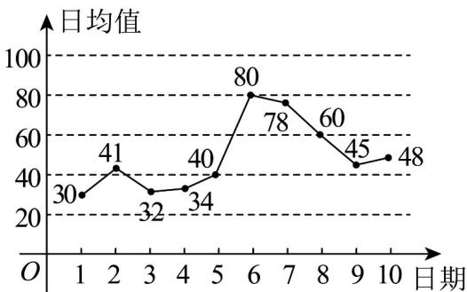

> [!faq]- 《专题9.2 用样本估计总体（高效培优讲义）数学人教A版高一必修第二册》官方解析
>
> > [!success]- **【答案】**  A. 这 $^{10}$ 天 PM2.5 的日均值逐日增大 B. 这 $^{10}$ 天中 PM2.5 日均值的平均值是 48.8 C. 从 PM2.5 日均值看，前 $^{5}$ 天的日均值的标准差小于后 $^{5}$ 天的日均值的标准差 D. 这 $10$ 天PM2.5日均值超标的有 $3$ 天
>
> > [!note]- **【分析】**
> > 由图可判断 $^{A}$ ；根据平均数计算公式可判断 $^{B}$ ；分别求出前 $^{5}$ 天的日均值的标准差及后 $^{5}$ 天的日均值
> >
> > 的标准差可判断 C；结合图中数据可判断 D.
>
> > [!note]- **【解析】**
> > 对于 $^{A}$ ，由图可知这10天PM2.5的日均值有增有减，故 $^{A}$ 错误；
> >
> > 对于 B，这 $^{10}$ 天中 PM2.5 日均值的平均值
> >
> > $$
> > \bar {x} = \frac {1}{1 0} (3 0 + 4 1 + 3 2 + 3 4 + 4 0 + 8 0 + 7 8 + 6 0 + 4 5 + 4 8) = 4 8. 8
> > $$
> >
> > ，故 $^{B}$ 正
> >
> > 确；
> >
> > $$
> > \mathrm{C}
> > $$
> >
> > $$
> > 5
> > $$
> >
> > $$
> > \frac {3 0 + 4 1 + 3 2 + 3 4 + 4 0}{5} = 3 5. 4
> > $$
> >
> > $$
> > 5
> > $$
> >
> > $$
> > \frac {8 0 + 7 8 + 6 0 + 4 5 + 4 8}{5} = 6 2. 2
> > $$
> >
> > 所以前 $^{5}$ 天的日均值的方差 $\frac{1}{5}\sum_{i=1}^{5}(x_{i}-35.4)^{2}=19.02$
> >
> > 后 $^{5}$ 天日均值的方差 $\frac{1}{5}\sum_{i=6}^{10}(x_{i}-62.2)^{2}=213.76$
> >
> > 因为 $19.02 < 213.76$ ，所以前 $^5$ 天的日均值的方差小于后 $^5$ 天的日均值的方差，
> >
> > 故前 $^{5}$ 天的日均值的标准差小于后 $^{5}$ 天的日均值的标准差，故 $^{C}$ 正确；
> >
> > 对于 D，由图可知 12 月 6、7 这两天的 PM2.5 大于 75，故 D 错误
> >
> > 故选 **BC**.
