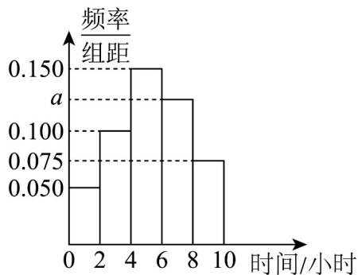

<!-- question-source:start -->
【典例1】已知某学校高一学生共有 $^{600}$ 人，为了解高一学生的课外阅读时间，从中随机抽取了 $^{100}$ 位同学进行调查，将他们上周课外阅读的时间（单位：小时）按照 $[0,2)、[2,4)、[4,6)、[6,8)、[8,10]$ 分成5组，制成如

图所示的频率分布直方图·

(1)求图中 a 的值并估计样本数据的第 $^{65}$ 百分位数；

(2)已知样本中阅读时间大于等于 $^{4}$ 小时的学生中，男、女学生各占一半，阅读时间小于 $^{4}$ 小时的学生中男生占

$\frac{1}{6}$ ，试估计该学校高一年级男生的人数·
<!-- question-source:end -->

![[高中/课堂同步/题库/人教A版高中数学同步讲义(2026)/02_必修第二册/第九章 统计/专题9.2 用样本估计总体（高效培优讲义）数学人教A版高一必修第二册/题型04_百分位数在具体数据中的应用/questions/answers/Q00078091A1.md]]
