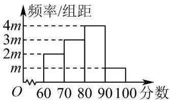

<!-- question-source:start -->
【变式1】近年来，楚雄州以千年彝绣为媒，探索幸福就业新路径，持续助力乡村振兴，实现了“培树一个品

牌、带动一片就业、富裕一方百姓”的发展目标．楚雄州把彝绣及相关工种列为补贴性职业技能培训的重要内

容，积极选拔培养彝绣高技能人才．目前，彝绣行业已有 $^{18}$ 名从业者获评“兴楚名匠”，占全州“兴楚名匠”总

数的 $16\%$ ，是各行业中占比最高的领域．某机构对 $^{100}$ 名绣娘的彝绣技艺进行了评分，将得到的分数按

$[60,70)$ ， $[70,80)$ ， $[80,90)$ ， $[90,100]$ 分为 $^4$ 组，画出如图所示的频率分布直方图.

(1)求 $m$ 的值；

(2)估计这 100 名绣娘的彝绣技艺分数的平均数（同一组中的数据用该组区间的中点值作为代表）；

(3)若彝绣技艺分数较高的 $20\%$ 绣娘被评为“彝绣工匠”，试估计被评为“彝绣工匠”的绣娘的最低分数。
<!-- question-source:end -->

![[高中/课堂同步/题库/人教A版高中数学同步讲义(2026)/02_必修第二册/第九章 统计/专题9.2 用样本估计总体（高效培优讲义）数学人教A版高一必修第二册/题型04_百分位数在具体数据中的应用/questions/answers/Q00078092A1.md]]
