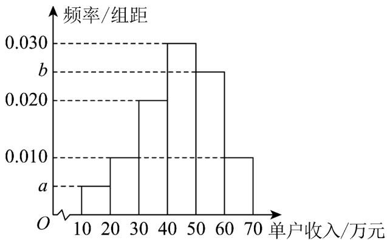

<!-- question-source:start -->
【典例1】2025 年，国家统计局海南调查总队为制定自贸港民生政策，从海南省某城乡区随机抽取100户居

民的单户收入作为样本数据，将这100户居民的单户收入 $x$ （ $10 \leq x \leq 70$ ，单位：万元）分成六段： $[10,20)$ 、

$\left[20,30\right)$ 、L、 $[60,70]$ ，并作出如图所示的频率分布直方图，其中 $b = 5a$ 。

(1)求 $a$ 、 $b$ 的值；

(2)若要对单户收入高于第 $80$ 百分位数的居民进行个税统计，则应对单户收入多少以上的居民进行统计？

(3)已知落在 $\left[30,40\right)$ 上的样本数据的平均数是 $^{38}$ ，方差是 $^{2}$ ， $\left[40,50\right)$ 上的样本数据的平均数是 $^{43}$ ，方差是 $^{5}$ .

求这两组数据的总平均数 $\overline{x}$ 和总方差 $s^{2}$ .

参考公式：分层随机抽样抽取的两层的样本量为 $m$ 、 $n$ ，若这两层的平均数和方差分别为 $\overline{x}$ 、 $s_1^2$ 与 $\overline{y}$ 、 $s_2^2$

记总的样本平均数为 $\overline{w}$ ，样本方差为 $s^2$ ，则① $\overline{w} = \frac{m}{m + n}\overline{x} +\frac{n}{m + n}\overline{y}$ ；②

$$
s ^ {2} = \frac {1}{m + n} \left\{m \left[ s _ {1} ^ {2} + (\bar {x} - \bar {w}) ^ {2} \right] + n \left[ s _ {2} ^ {2} + (\bar {y} - \bar {w}) ^ {2} \right] \right\}.
$$
<!-- question-source:end -->

![[高中/课堂同步/题库/人教A版高中数学同步讲义(2026)/02_必修第二册/第九章 统计/专题9.2 用样本估计总体（高效培优讲义）数学人教A版高一必修第二册/题型05_平均数_中位数_众数在具体数据中的应用/questions/answers/Q00078095A1.md]]
