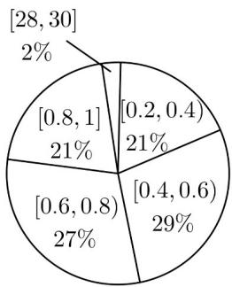
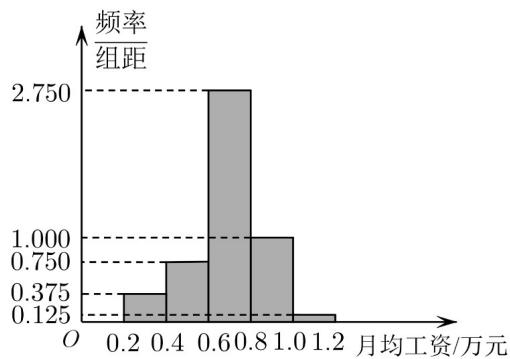

<!-- question-source:start -->
【变式2】已知 $A$ ， $B$ 两家公司的员工月均工资（单位：万元）情况分别如图1，图2所示：

图1

图2

(1)以每组数据的区间中点值为代表，根据图 $^{1}$ 估计A公司员工月均工资的平均数、中位数，你认为用哪个数

据更能反映该公司普通员工的工资水平？请说明理由。

(2)小明拟到 $A$ ， $B$ 两家公司中的一家应聘，以公司普通员工的工资水平作为决策依据，他应该选哪个公司？
<!-- question-source:end -->

![[高中/课堂同步/题库/人教A版高中数学同步讲义(2026)/02_必修第二册/第九章 统计/专题9.2 用样本估计总体（高效培优讲义）数学人教A版高一必修第二册/题型05_平均数_中位数_众数在具体数据中的应用/questions/answers/Q00078097A1.md]]
