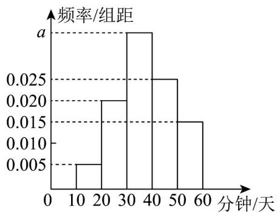
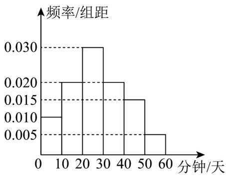

<!-- question-source:start -->
【变式3】随着高校强基计划招生的持续开展，我市高中生抓起了参与数学兴趣小组的热潮·为调查我市高中

生对数学学习的喜好程度，从甲、乙两所高中各随机抽取了 $^{40}$ 场学生，记录他们在一周内平均每天学习数学

的时间，并将其分成了6个区间：(0,10]、(10,20]、(20,30]、(30,40]、(40,50]、(50,60]，整理得到如图频率分

布直方图：

图1:甲高中

图2:乙高中

(1)求图 $^{1}$ 中a的值，并估计甲高中学生一周内平均每天学习数学时间的众数；

(2)估计乙高中学生一周内平均每天学习数学时间的均值 $x_{\text{乙}}$ 及方差 $s_{\text{乙}}^2$ （同一组中的数据用该组区间的中点值

作代表);

(3)若从甲、乙两所高中分别抽取样本量为 $m$ 、 $n$ 的两个样本，经计算得它们的平均数和方差分别为 $\overline{x}$ 、 $s_1^2$ 与

$\overline{y}$ 、 $s_2^2$ ，记总的样本平均数为 $\overline{w}$ ，样本方差为 $s^2$ ，证明：

① $\overline{w}=\frac{m}{m+n}\overline{x}+\frac{n}{m+n}\overline{y}$ ;

$$
s ^ {2} = \frac {1}{m + n} \left\{m \left[ s _ {1} ^ {2} + (\bar {x} - \bar {w}) ^ {2} \right] + n \left[ s _ {2} ^ {2} + (\bar {y} - \bar {w}) ^ {2} \right] \right\}
$$
<!-- question-source:end -->

![[高中/课堂同步/题库/人教A版高中数学同步讲义(2026)/02_必修第二册/第九章 统计/专题9.2 用样本估计总体（高效培优讲义）数学人教A版高一必修第二册/题型06_标准差与方差的应用/questions/answers/Q00078102A1.md]]
