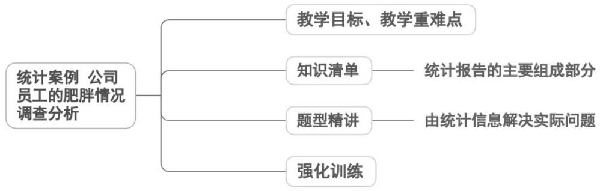

<!-- source-part:1 pages:1-17 -->

专题 9.3 统计案例 公司员工的肥胖情况调查分析

## 教学目标、教学重难点

<table><tr><td>教学目标</td><td>1.掌握统计案例分析的完整流程,明确统计分析报告的核心组成部分(标题、前言、主体、结尾),理解分层随机抽样在实际调查中的应用逻辑。2.能根据BMI数据特征,选择合适的统计图表(频率分布直方图为主)进行数据可视化描述,熟练计算样本的平均数、中位数、方差、标准差等数字特征。3.理解分层随机抽样下总体平均数与方差的合成公式,能通过样本数据估计总体的肥胖分布规律,区分偏瘦、正常、偏胖、肥胖的BMI分类标准。</td></tr><tr><td>教学重难点</td><td>1.重点分层随机抽样的特点及总体平均数、方差的合成计算,能通过样本数据合理推断总体情况。2.难点将统计分析结果转化为具有可行性的建议,实现“数据分析—结论推断—实践指导”的闭环,提升知识应用的深度与实用性。</td></tr></table>

![[高中/课堂同步/题库/人教A版高中数学同步讲义(2026)/02_必修第二册/第九章 统计/专题9.3 统计案例  公司员工的肥胖情况调查分析（高效培优讲义）数学人教A版高一必修第二册/知识清单/知识清单.md]]
![[高中/课堂同步/题库/人教A版高中数学同步讲义(2026)/02_必修第二册/第九章 统计/专题9.3 统计案例  公司员工的肥胖情况调查分析（高效培优讲义）数学人教A版高一必修第二册/题型精讲/题型精讲.md]]
![[高中/课堂同步/题库/人教A版高中数学同步讲义(2026)/02_必修第二册/第九章 统计/专题9.3 统计案例  公司员工的肥胖情况调查分析（高效培优讲义）数学人教A版高一必修第二册/强化训练/强化训练.md]]
