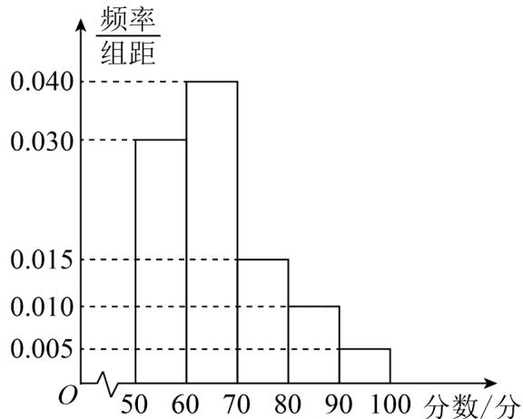

<!-- question-source:start -->
1. 某中学举行电脑知识竞赛，现将高一参赛学生的成绩进行整理后分成五组绘制成如图所示的频率分布直方

图，已知图中从左到右的第一、二、三、四、五小组的频率分别是 0.30, 0.40, 0.15, 0.10, 0.05.

求：(1)高一参赛学生的成绩的众数、中位数；

(2)高一参赛学生的平均成绩.
<!-- question-source:end -->

![[高中/课堂同步/题库/人教A版高中数学同步讲义(2026)/02_必修第二册/第九章 统计/专题9.3 统计案例  公司员工的肥胖情况调查分析（高效培优讲义）数学人教A版高一必修第二册/强化训练/questions/answers/Q00078113A1.md]]
