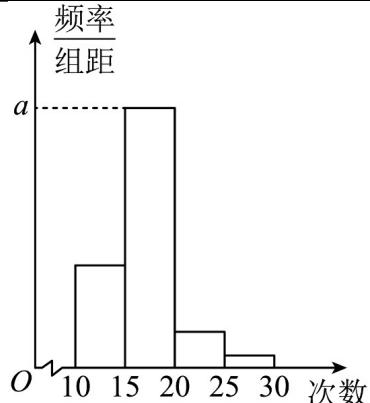
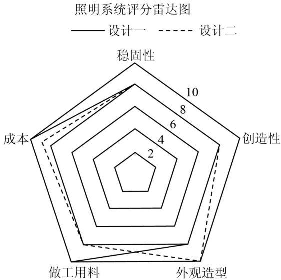

## 知识清单

## 知识点 统计报告的主要组成部分

1、标题.

2、前言：简单交代调查的目的、方法、范围等背景情况，使读者了解调查的基本情况。

3、主题：展示数据分析的全过程；首先要明确所关心的问题是什么，说明数据蕴含的信息；根据数据分析的

需要，说明如何选择合适的图标描述和表达数据；从样本数据中提取能刻画其特征的量，如均值、方差等，

用于比较男、女员工在肥胖状况上的差异；通过样本估计总体的统计规律，分析公司员工胖瘦程度的整体。

4、结尾：对主题部分的内容进行概括，结合控制体重的一般方法，提出控制公司员工体重的建议。

【即学即练】

1. 对某校高三年级学生参加社区服务次数进行统计，随机抽取 $M$ 名学生作为样本，得到这 $M$ 名学生参加社

区服务的次数，根据此数据作出了频数与频率的统计表和频率分布直方图。

<table><tr><td>分组</td><td>频数</td><td>频率</td></tr><tr><td>[10,15)</td><td>10</td><td>0.25</td></tr><tr><td>[15,20)</td><td>24</td><td>n</td></tr><tr><td>[20,25)</td><td>m</td><td>p</td></tr><tr><td>[25,30]</td><td>2</td><td>0.05</td></tr><tr><td>合计</td><td>M</td><td>1</td></tr></table>

(1)求表中 $M$ 、 $p$ 及图中 $a$ 的值；

(2)若该校高三年级学生有 $^{240}$ 人，试估计该校高三年级学生参加社区服务的次数在区间 $^{[10,15)}$ 上的人数；

(3)估计这次学生参加社区服务次数的众数、中位数以及平均数．（结果精确到0.01）

【答案】(1) M = 40, p = 0.1, a = 0.12

(2)60

(3)众,数 17.50，中位 17.08，平均数 17.25

【分析】（1）由分组 $[10,15)$ 上的频数是 $10$ ，频率是 $0.25$ ，求得 $M = 40$ ，根据频数之和为40，求得 $m$ 和 $p$

的值，进而求得 $a$ 的值；

(2) 因为该校高三年级学生有 240 人，在 $[10,15)$ 上的频率是 0.25，即可求得该校高三年级学生参加社区服

务的次数在此区间上的人数；

(3) 根据众数、中位数和平均数的计算方法，即可求解·

【详解】（1）解：由分组 $\left[10,15\right)$ 上的频数是 $10$ ，频率是 $0.25$ ，可得 $\frac{10}{M} = 0.25$ ，解得 $M = 40$

因为频数之和为 40，所以 $10 + 24 + m + 2 = 40$ ，解得 $m = 4$ ，所以 $p = \frac{m}{M} = 0.1$

因为 $a$ 是对应分组 $[15,20)$ 的频率与组距的商，所以 $a = \frac{24}{40 \times 5} = 0.12$

(2) 解：因为该校高三年级学生有 240 人，在 $[10,15)$ 上的频率是 0.25，

所以估计该校高三年级学生参加社区服务的次数在此区间上的人数力 $240 \times 0.25 = 60$

(3) 解：估计这次学生参加社区服务次数的众数是 $\frac{15 + 20}{2} = 17.50$

因为 $n = \frac{24}{40} = 0.6$ ，又 $0.25 < 0.5$ 且 $0.25 + 0.6 > 0.5$ ，所以中位数在区间[15,20）上.

因为中位数及前面的数的频率之和为 0.5，设样本中位数为 x，

则 $0.25 + (x - 15) \cdot 0.12 = 0.5$ ，解得 $x \approx 17.08$ 。

估计这次学生参加社区服务次数的中位数是 17.08 .

样本平均数是 $12.5 \times 0.25 + 17.5 \times 0.6 + 22.5 \times 0.1 + 27.5 \times 0.05 = 17.25$

估计这次学生参加社区服务次数的平均数是 17.25 .

2. 某装修公司为了解客户对照明系统的需求，对照明系统的两种设计方案在稳固性、创新性、外观造型、做

工用料以及成本五个方面的满意度评分进行统计，根据统计结果绘制出如图所示的雷达图，则下列说法错误

的是（ ）

A. 客户对两种设计方案在外观造型上没有分歧

B．客户对设计一的满意度的总得分高于设计二的满意度的总得分

C. 客户对设计二在创新性方面的满意度高于设计一在创新性方面的满意度

D．客户对两种设计方案在稳固性和做工用料方面的满意度相同

【答案】ACD

【分析】通过阅读雷达图，找到其对应的数据，转化成熟悉的表格即可·

【详解】根据雷达图可列表如下：

<table><tr><td>评分类别</td><td>稳固性</td><td>创新性</td><td>外观造型</td><td>做工用料</td><td>成本</td></tr><tr><td>设计一得分</td><td>8分</td><td>8分</td><td>8分</td><td>10分</td><td>10分</td></tr><tr><td>设计二得分</td><td>8分</td><td>8分</td><td>10分</td><td>8分</td><td>9分</td></tr></table>

根据表格分析可得 A、C、D 错误，选项 B 正确.
