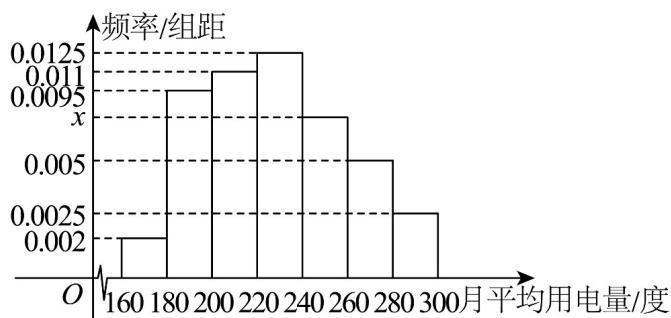

<!-- question-source:start -->
8. 某城市户居民的月平均用电量（单位：度），以 $[160,180),[180,200),[200,220),[220,240),[240,260),[260,280),[280,300]$ 分组的频率分布直方图如图．则下
列说法错误的是（）

A. 直方图中 $x = 0.0075$ B. 图中所有矩形面积之和为 1
C. 月平均用电量的中位数为 225
D. 在月平均用电量为 $[220, 240), [240, 260), [260, 280), [280, 300]$ 的四组用户中，用分层抽样的方法抽取 11 户居民，月平均用电量在 $[220, 240)$ 的用户中应抽取 5 户。
<!-- question-source:end -->

![[高中/课堂同步/题库/人教A版高中数学同步讲义(2026)/02_必修第二册/第九章 统计/单元测试/第九章_统计_高效培优单元自测_强化卷_数学人教A版高一必修第二册/一_选择题_sec_02/questions/answers/Q00064907A1.md]]
