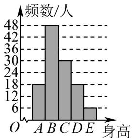
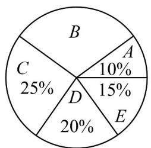

<!-- question-source:start -->
9. 某市教育局对全市高三年级的学生身高进行抽样调查，随机抽取了 $200$ 名学生，他们的身高都处在

$A, B, C, D, E$ 五个层次内，根据抽样结果得到统计图表，则样本中（）

女生身高情况直方图 男生身高情况扇形图

A. 女生人数多于男生人数（）
B. D层次男生人数多于女生人数
C. B层次男生人数为 $^{24}$ 人
D. A层次人数最少
<!-- question-source:end -->

![[高中/课堂同步/题库/人教A版高中数学同步讲义(2026)/02_必修第二册/第九章 统计/单元测试/第九章_统计_高效培优单元自测_强化卷_数学人教A版高一必修第二册/一_选择题_sec_02/questions/answers/Q00064908A1.md]]
