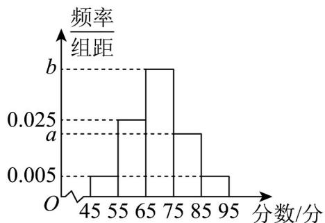

> [!faq]- 《第九章_统计_高效培优单元自测_强化卷_数学人教A版高一必修第二册》官方解析
>
> > [!success]- **【答案】** A. 20 B. 30 C. 40 D. 50
>
> > [!note]- **【分析】**
> > 根据分层抽样公式，按比例抽取，即可求解·
>
> > [!note]- **【解析】**
> > 女生应抽出的人数为 $120 \times \frac{400}{800 + 400} = 40$
> >
> > 故选：C
> >
> > 3. 为调查社区居民对社区工作的满意度，在社区内抽取 $^{200}$ 名居民进行问卷调查，将收集到的数据分成五组，绘制出以下频率分布直方图，若 $[65,75)$ 的频率为 $0.48$ ， $a$ ， $b$ 的值为（）
> >
> > 【答案】
> >
> > 
> >
> > 频率组距
> > b
> > a
> > O
> > 45 55 65 75 85 95 分数/分
> > A .017 , 0.048
> > B .017 , 0.48
> > C .017 , 0.048
> > D .017 , 0.48
> >
> > 【答案】A
> >
> > 【分析】根据已知条件，由频率分布直方图中矩形高度的概念可求出 $b$ ，由频率分布直方图中各组矩形面积之和为 $1$ ，即可求出 $a\cdot$ 【详解】由频率分布直方图可知组距为 $10$ ，则 $b = \frac{0.48}{10} = 0.048$ 又因为 $(0.005 + 0.025 + b + a + 0.005) \times 10 = 1$ ，解得 $a = 0.017\cdot$
> >
> > 故选 **A**
