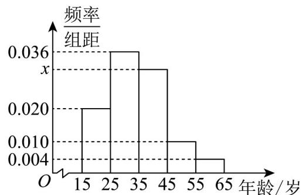

<!-- question-source:start -->
16.（15分）某学校兴趣小组为了了解移动支付在大众中的熟知度，对 $15\sim 65$ 岁的人群进行了随机抽样调

查，调查的问题是“你会使用移动支付吗？”其中，会使用移动支付的共有 $n$ 个人，把这 $n$ 个人按照年龄分

成 $^{5}$ 组：第 $^{1}$ 组为 $^{[15,25)}$ ，第 $^{2}$ 组为 $^{[25,35)}$ ，第 $^{3}$ 组为 $^{[35,45)}$ ，第 $^{4}$ 组为 $^{[45,55)}$ ，第 $^{5}$ 组为

[55, 65]，然后绘制成如图所示的频率分布直方图，其中，第 $^{1}$ 组的频数为 $^{20}$ .

(1)求 $n$ 和 $x$ 的值：

(2)从第 $^{1}$ ， $^{3}$ ， $^{4}$ 组中用分层随机抽样的方法抽取 $^{6}$ 人，求分别从第 $^{1}$ ， $^{3}$ ， $^{4}$ 组中抽取的人数；
<!-- question-source:end -->

![[高中/课堂同步/题库/人教A版高中数学同步讲义(2026)/02_必修第二册/第九章 统计/单元测试/第九章_统计_高效培优单元自测_强化卷_数学人教A版高一必修第二册/三_填空题_sec_04/questions/answers/Q00064913A1.md]]
