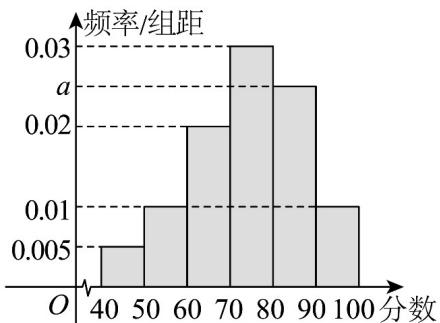

<!-- question-source:start -->
17．（15分）某校举办了“趣味数学”知识竞赛，从所有答卷中随机抽取 $^{100}$ 份成绩（满分 $^{100}$ 分，成绩均

为不低于 $40$ 分的整数）作为样本，将样本分成六段： $[40,50)$ ， $[50,60)$ ，L， $[90,100]$ ，得到如图所示的

频率分布直方图.

(1)求频率分布直方图中 a 的值及样本平均数；

(2)试估计这 100 名学生的分数 $x_{i}(i=1,2,\cdots,100)$ 的方差 $s^{2}$ ，并判断此次得分为 60 分和 80 分的两名同学的成绩是否进入到了 $\left[\overline{x}-s,\overline{x}+s\right]$ 范围内？（用每组的区间的中点代替该组的分数）
<!-- question-source:end -->

![[高中/课堂同步/题库/人教A版高中数学同步讲义(2026)/02_必修第二册/第九章 统计/单元测试/第九章_统计_高效培优单元自测_强化卷_数学人教A版高一必修第二册/三_填空题_sec_04/questions/answers/Q00064914A1.md]]
