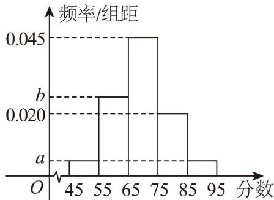

<!-- question-source:start -->
19．（17分）现随机抽取了100名候选者的面试成绩，并分成五组：第一组 $[45,55)$ ，第二组 $[55,65)$ ，第

三组[65,75)，第四组[75,85)，第五组[85,95)，绘制成如图所示的频率分布直方图．已知第一、二组的频

率之和为 0.3，第一组和第五组的频率相同。

(1)估计这 $^{100}$ 名候选者面试成绩的平均数和第 $^{25}$ 百分位数；

(2)在这 $100$ 名候选者用分层随机抽样的方法从第四组和第五组面试者内抽取 $^{10}$ 人，再从这 $^{10}$ 名面试者中

随机抽取两名，求两名面试者成绩都在第五组的概率。

(3)现从以上各组中用分层随机抽样的方法选取 $^{20}$ 人，担任本市的宣传者。若本市宣传者中第二组面试者

的面试成绩的平均数和方差分别为 $62$ 和 $40$ ，第四组面试者的面试成绩的平均数和方差分别为 $80$ 和 $70$ ，据

此估计这次第二组和第四组所有面试者的面试成绩的方差.
<!-- question-source:end -->

![[高中/课堂同步/题库/人教A版高中数学同步讲义(2026)/02_必修第二册/第九章 统计/单元测试/第九章_统计_高效培优单元自测_强化卷_数学人教A版高一必修第二册/三_填空题_sec_04/questions/answers/Q00064916A1.md]]
