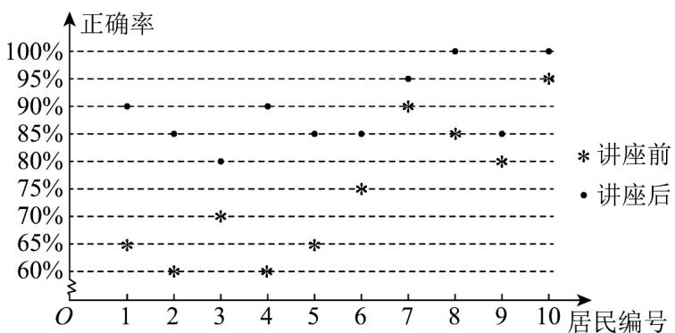

<!-- question-source:start -->
3. 某社区通过公益讲座以普及社区居民的垃圾分类知识，为了解讲座效果，随机抽取 $^{10}$ 位社区居民，让他们在讲座前和讲座后各回答一份垃圾分类知识问卷，这 $^{10}$ 位社区居民在讲座前和讲座后问卷答题的正确

率如图，则（）

A. 讲座后问卷答题的正确率的极差大于讲座前正确率的极差

B．讲座前问卷答题的正确率的中位数小于70%

C．讲座后问卷答题的正确率的 70 百分位数是 90%

D．讲座后问卷答题的正确率的平均数大于85%

##
<!-- question-source:end -->

![[高中/课堂同步/题库/人教A版高中数学同步讲义(2026)/02_必修第二册/第九章 统计/单元测试/第九章_统计_高效培优单元自测_提升卷_数学人教A版高一必修第二册/一_选择题_sec_02/questions/answers/Q00064918A1.md]]
