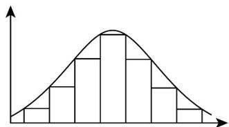
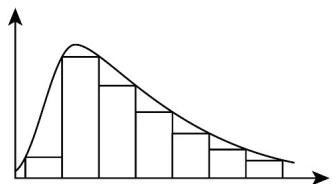
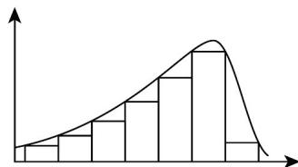

<!-- question-source:start -->
9. 如图所示，下列频率分布直方图均为单峰的分布直方图．图（1）的直方图形状是对称的，图（2）的

直方图在右边“拖尾”，图（3）的直方图在左边“拖尾”，据此作出判断，正确的是（）

图(1)

图(2)

图(3)

A. 图（1）的平均数 $=$ 中位数 $=$ 众数

B. 图（3）的平均数 $<$ 中位数 $<$ 众数

C. 图（2）的众数 $<$ 中位数 $<$ 平均数

D．图 $(2)$ 的平均数＜众数＜中位数
<!-- question-source:end -->

![[高中/课堂同步/题库/人教A版高中数学同步讲义(2026)/02_必修第二册/第九章 统计/单元测试/第九章_统计_高效培优单元自测_提升卷_数学人教A版高一必修第二册/一_选择题_sec_02/questions/answers/Q00064922A1.md]]
