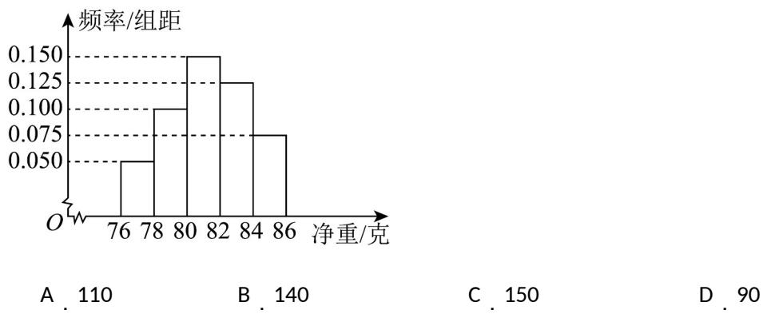

> [!faq]- 《第九章_统计_高效培优单元自测_提升卷_数学人教A版高一必修第二册》官方解析
>
> > [!success]- **【答案】** 
>
> > [!note]- **【分析】**
> > 根据频率分布直方图中的数据，求得净重大于或等于 $^{80}$ 克的频率为 0.7，进而的得到答案
>
> > [!note]- **【解析】**
> > 由频率分布直方图，可得净重大于或等于 $^{80}$ 克的频率为 $P = (0.15 + 0.125 + 0.075) \times 2 = 0.7$ ，
> > 所以净重大于或等于 $^{80}$ 克的个数为 $200 \times 0.7 = 140$ 个.
> >
> > 故选 **B**.
