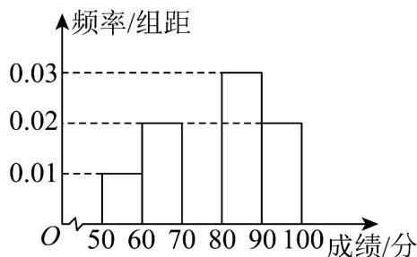

> [!faq]- 《第九章_统计_高效培优单元自测_提升卷_数学人教A版高一必修第二册》官方解析
>
> > [!success]- **【答案】**  A. 成绩在 $\left[80,90\right)$ 上的人数最多 B. 成绩不低于 $70$ 分的学生所占比例为 $70\%$ C. 50名学生成绩的平均分小于中位数 D. 50名学生成绩的极差为 $50$
>
> > [!note]- **【分析】**
> > 根据频率分布直方图求出 $\left[70,80\right)$ 的频率，A项可由各矩形高度可判断；B项由频率计算可判断；
> > C项分别求出平均数、中位数比较可判断；D项由极差定义可判断·
>
> > [!note]- **【解析】**
> > 设 $\left[70,80\right)$ 组的频率为a，则由各组频率之和为 $^{1}$ 可得 $10\times(0.01+0.02+0.03+0.02)+a=0.8+a=1$ ，解得a=0.2 $[50,60)$ ， $[60,70)$ ， $[70,80)$ ， $[80,90)$ ， $[90,100]$ 各组频率依次为： $[50,60)$ ， $[60,70)$ ， $[70,80)$ ， $[80,90)$ ，
> >
> > 0.1, 0.2, 0.2, 0.3, 0.2
> >
> > 对于 $^{A}$ ， $[80,90)$ 组频率最大，即成绩在 $[80,90)$ 上的人数最多，故 $^{A}$ 正确；
> >
> > 对于 $^{B}$ ，成绩低于 $^{70}$ 分的学生频率为 $0.1 + 0.2 = 0.3$ ，即不低于 $^{70}$ 分的学生频率为 $1 - 0.3 = 0.7$
> >
> > 所以成绩不低于 $^{70}$ 分的学生所占比例为 $70\%$ ，故 $^{B}$ 正确；
> >
> > 对于 C，根据频率分布直方图，可得 50 名学生成绩的平均数是
> >
> > $$
> > 5 5 \times 0. 1 + 6 5 \times 0. 2 + 7 5 \times 0. 2 + 8 5 \times 0. 3 + 9 5 \times 0. 2 = 7 8
> > $$
> >
> > 由 $0.1 + 0.2 + 0.2 = 0.5$ ，故 50 名学生成绩的中位数为 80，
> >
> > 所以 $^{50}$ 名学生成绩的平均分小于中位数，故选项 $^{C}$ 正确；
> >
> > 对于 $^{D}$ ，极差为数据中最大值与最小值的差，已知 $^{50}$ 名学生的成绩都在区间 $[50,100]$ 内，但成绩的最大
> >
> > 值不一定是 $100$ ，最小值也不一定是 $50$ ，故极差小于等于 $50$ ，
> >
> > 但不一定等于 $50$ ，故 $\mathbf{D}$ 错误·
> >
> > 故选：ABC.
> >
> > 7. 经过简单随机抽样获得的样本数据为 $X_{1}, x_{2}, \ldots, x_{n}$ , 且数据 $X_{1}, x_{2}, \ldots, x_{n}$ 的平均数为 $\overline{x}$ , 方差为
> >
> > 【答案】
> >
> > $s^{2}$ ，则下列说法正确的是（）
> >
> > A．若 $s^{2}=0$ ，则所有的数据 $x_{i}(i=1,2,\cdots,n)$ 都为 0
> >
> > B．若 $\bar{x}=3$ ，则 $y_{i}=2x_{i}+1(i=1,2,\cdots,n)$ 的平均数为 6
> >
> > C．若 $s^{2}=3$ ，则 $y_{i}=2x_{i}+1(i=1,2,\cdots,n)$ 的方差为 12
> >
> > D．若该组数据的 25% 分位数为 90，则可以估计总体中至少有 75% 的数据不大于 90
> >
> > 【答案】C
> >
> > 【分析】由平均数的方差的性质可判断 A, B, C；由百分位数的定义可判断 D.
> >
> > 【详解】对于 A，数据 $X_{1}$ ， $x_{2}$ ，…， $x_{n}$ 的方差 $s^{2}=0$ 时，说明所有的数据 $X_{1}$ ， $x_{2}$ ，…， $x_{n}$ 都相等，
> >
> > 但不一定为 $^{0}$ ，故选项 $^{A}$ 错误；
> >
> > 对于 B，数据 $X_{1}$ ， $x_{2}$ ，…， $x_{n}$ 的平均数 $\overline{x}=3$ ，
> >
> > 数据 $y_{i}=2x_{i}+1(i=1,2,\cdots,n)$ 的平均数为 $2\times3+1=7$ ，故选项 B 错误；
> >
> > 对于 C，数据 $X_{1}$ ， $x_{2}$ ，…， $x_{n}$ 的方差为 $s^{2}=3$ ，
> >
> > 数据 $y_{i}=2x_{i}+1(i=1,2,\cdots,n)$ 的方差为 $2^{2}\times3=12$ ，故选项 C 正确；
> >
> > 对于 D，数据 $X_{1}$ ， $x_{2}$ ，…， $x_{n}$ 的 25% 分位数为 90，则可以估计总体中有至少有 75% 的数据大于或等于 90，
> >
> > 故选项 D 错误·
> >
> > 故选：C.
> >
> > 8. 一组单调递增数据 $X_{1}, x_{2}, \ldots, x_{n}$ 的平均数、极差、中位数、方差依次为 $\overline{x}$ , $\Delta x, m, s_{1}^{2}$ , 构造一组
> >
> > 新的数据 $y_{1}$ ， $y_{2}$ ，…， $y_{n}$ ，其中 $y_{i}=3x_{i}-1(i=1,2,\cdots,n)$ ，新数据的平均数、极差、中位数、方差依次为
> >
> > $\overline{y}$ ， $\Delta y$ ，n， $s_{2}^{2}$ ，则下列结论中不正确的是（）
> >
> > A. 若 $\overline{x} = \overline{y}$ ，则 $\overline{x} = 0$ B. $\Delta y = 3\Delta x$
> >
> > C．若 $m+n=3$ ，则 n=2
> > D．若 $s_{1} + s_{2} = 4$ ，则 $s_{1} = 1$
> >
> > 【答案】A
> >
> > 【分析】利用极差和中位数的定义即可判断 BC，由平均数和方差的性质即可判断 AD.
> >
> > 【详解】对于 A：因为 $y_{i}=3x_{i}-1(i=1,2,\cdots,n)$ ，所以 $\overline{y}=3\overline{x}-1$ ，因为 $\overline{x}=\overline{y}$ ，所以 $\overline{x}=\frac{1}{2}$ ，故 A 错误；
> >
> > 对于 B：因为数据 $x_{1}$ ， $x_{2}$ ，…， $x_{n}$ 单调递增，所以数据 $y_{1}$ ， $y_{2}$ ，…， $y_{n}$ 也单调递增，
> >
> > 所以极差 $\Delta x = x_{n} - x_{1}$ ， $\Delta y = y_{n} - y_{1} = 3x_{n} - 1 - (3x_{1} - 1) = 3(x_{n} - x_{1}) = 3\Delta x$ ，故B正确；
> >
> > 对于 C：由 A 知 n = 3m - 1，因为 $m + n = 3$ ，所以 n = 2，故 C 正确；
> >
> > 对于 D：因为 $y_{i}=3x_{i}-1(i=1,2,\cdots,n)$ ，所以 $s_{2}^{2}=9s_{1}^{2}$ ，即 $s_{2}=3s_{1}$ ，
> >
> > 因为 $s_{1} + s_{2} = 4$ ，所以 $s_{1} = 1$ ，故 D 正确。
> >
> > 故选：A.
> >
> > ## 二、选择题：本题共 3 小题，每小题 6 分，共 18 分．在每小题给出的选项中，有多项符合题目要求．全部选对的得 6 分，部分选对的得部分分，有选错的得 0 分.
