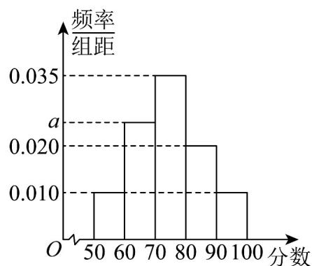

<!-- question-source:start -->
15．（13分）某零食超市某天接待了1250名顾客，老年375人，中青年625人，少年250人，景点为了提

升服务质量，采用分层抽样从当天游客中抽取 $100$ 人，以评分方式进行满意度回访。将统计结果按照

$[50,60), [60,70), [70,80), [80,90), [90,100]$ 分成 $^5$ 组，制成如下频率分布直方图：

(1)求抽取的样本中老年、中青年、少年的人数；

(2)求频率分布直方图中 $a$ 的值；

(3)估计当天游客满意度分值的85%分位数.
<!-- question-source:end -->

![[高中/课堂同步/题库/人教A版高中数学同步讲义(2026)/02_必修第二册/第九章 统计/单元测试/第九章_统计_高效培优单元自测_提升卷_数学人教A版高一必修第二册/三_填空题_sec_04/questions/answers/Q00064926A1.md]]
