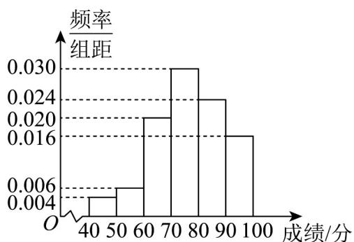

<!-- question-source:start -->
12．从高三抽出 $^{50}$ 名学生参加数学竞赛，由成绩得到如图的频率分布直方图，则估计这 $^{50}$ 名学生成绩的

75% 分位数为 \_\_\_\_ 分 .

<!-- question-source:end -->

![[高中/课堂同步/题库/人教A版高中数学同步讲义(2026)/02_必修第二册/第九章 统计/第九章 统计（高效培优单元自测·强化卷）数学人教A版高一必修第二册/三_填空题/questions/answers/Q00078127A1.md]]
