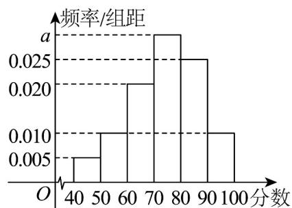

<!-- question-source:start -->
15. （13分）“数学好玩”是国际著名数学家陈省身赠送给少年数学爱好者们的一句话·某校为了更好地培养

学生创新精神和实践能力，特举办数学竞赛活动，在活动中，共有 $^{19}$ 道题·从所有答卷中随机抽取 $^{100}$ 份

作为样本，将样本的成绩（满分 $100$ 分，成绩均为不低于 $40$ 分的整数）分成六段： $[40,50)$ ， $[50,60)$ ，…

[90,100]，得到如图所示的频率分布直方图·

(1)求频率分布直方图中 $a$ 的值及样本成绩的上四分位数；

(2)已知落在 $[50,60)$ 的平均成绩是 $^{54}$ ，方差是 $^{7}$ ，落在 $[60,70)$ 的平均成绩为 $^{66}$ ，方差是 $^{4}$ ，求两组成绩合

并后的平均数 $\overline{z}$ 和方差 $s^{2}$ .
<!-- question-source:end -->

![[高中/课堂同步/题库/人教A版高中数学同步讲义(2026)/02_必修第二册/第九章 统计/第九章 统计（高效培优单元自测·强化卷）数学人教A版高一必修第二册/三_填空题/questions/answers/Q00078128A1.md]]
