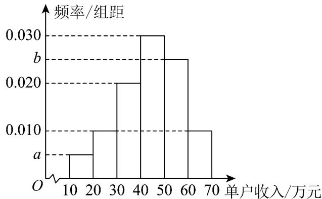

<!-- question-source:start -->
16.（15分）2025年，国家统计局海南调查总队为制定自贸港民生政策，从海南省某城乡区随机抽取100

户居民的单户收入作为样本数据，将这100户居民的单户收入 $x$ （ $10 \leq x \leq 70$ ，单位：万元）分成六段：

$\left[10,20\right)$ 、 $\left[20,30\right)$ 、L、 $\left[60,70\right]$ ，并作出如图所示的频率分布直方图，其中 $b = 5a$ 。

(1)求 $a$ 、 $b$ 的值；

(2)若要对单户收入高于第 $80$ 百分位数的居民进行个税统计，则应对单户收入多少以上的居民进行统计？

$$
\left[ 3 0, 4 0\right)
$$

$$
3 8
$$

$$
^ 2
$$

$$
4 3
$$

5·求这两组数据的总平均数 $\overline{x}$ 和总方差 $s^{2}$

参考公式：分层随机抽样抽取的两层的样本量为 $m$ 、 $n$ ，若这两层的平均数和方差分别为 $\overline{x}$ 、 $s_1^2$ 与 $\overline{y}$ 、 $s_2^2$

记总的样本平均数为 $\frac{-}{w}$ ，样本方差为 $s^2$ ，则① $\overline{w} = \frac{m}{m + n}\overline{x} + \frac{n}{m + n}\overline{y}$ ；②

$$
s ^ {2} = \frac {1}{m + n} \left\{m \left[ s _ {1} ^ {2} + (\bar {x} - \bar {w}) ^ {2} \right] + n \left[ s _ {2} ^ {2} + (\bar {y} - \bar {w}) ^ {2} \right] \right\}.
$$
<!-- question-source:end -->

![[高中/课堂同步/题库/人教A版高中数学同步讲义(2026)/02_必修第二册/第九章 统计/第九章 统计（高效培优单元自测·提升卷）数学人教A版高一必修第二册/三_填空题/questions/answers/Q00078143A1.md]]
