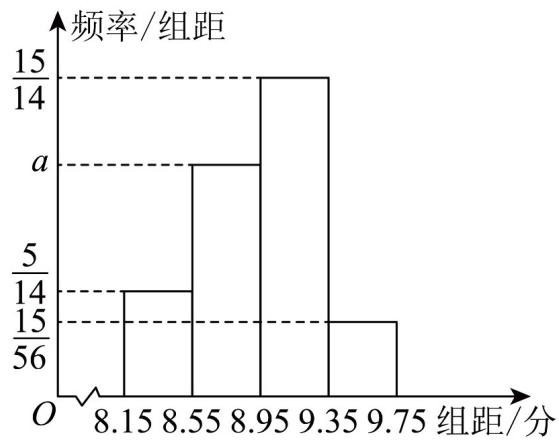

<!-- question-source:start -->
17. （15分）重庆市杨家坪中学第十二届“爱国奋斗 强国励志”大成风采艺术节高 2027 届合唱比赛 28 个班

级结果分数 $x$ 分成四段： $[8.15,8.55],[8.55,8.95],[8.95,9.35],[9.35,9.75]$ ，并作出如图所示的频率分布直方图·

(1)求出 $a$ 的值；

(2)已知样本数据落在[8.55, 8.95]的平均分是8.778，落在[8.95, 9.35]的平均分是9.161.求这两组数据的总

平均数 $x$

(3)已知上四分位的班级获得特等奖，求出多少分以上为特等奖答案保留三位小数；
<!-- question-source:end -->

![[高中/课堂同步/题库/人教A版高中数学同步讲义(2026)/02_必修第二册/第九章 统计/第九章 统计（高效培优单元自测·提升卷）数学人教A版高一必修第二册/三_填空题/questions/answers/Q00078144A1.md]]
