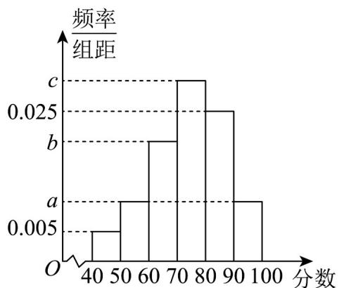

<!-- question-source:start -->
18. (17 分) 某市消防救援大队为了提高市民对安全的重视及应对突发情况的能力，对本市市民组织了一

次逃生及安全常识（综合安全事故、自然灾害等）网络测试，满分为 $100$ 分·测试完后抽取了 $400$ 份试卷，

把分数按 $[40,50), [50,60), L, [90,100]$ 依次分为第一至第六组（所有得分 $x$ 均满足 $40 \leq x \leq 100$ ），其中

$\left[50,60\right)$ 与 $\left[90,100\right]$ 的人数均为 $^{40}$ 人，统计各组频数并计算相应频率，绘制出如图所示的频率分布直方图·

若同一组中的数据用该组区间的中点值作代表，以频率估计概率，得出本次测试成绩的平均分为 $^{74}$ 分·

(1)求图中 a 的值，并估计本次测试的及格率（“及格率”指得分为 60 分及以上的市民所占比例）；

(2)分别求图中 $b$ 的值与 $c$ 的值；

(3)已知落在区间 $[60,70)$ 的样本平均分是 $^{63}$ ，方差是 $^{7}$ ，落在区间 $[70,80)$ 的样本平均分是 $^{78}$ ，方差是 $^{4}$ ，

求两组样本成绩合并后的平均分 $\bar{\omega}$ 和方差 $s^{2}$

参考公式：若总体划分为 $^2$ 层，通过分层随机抽样，各层抽取的样本量、样本平均数和样本方差分别为：

$m, \overline{x}, s_1^2; n, \overline{y}, s_2^2$ ，记总的样本平均数为 $\overline{\omega}$ ，样本方差为 $s^2$ ，则 $s^2 = \frac{1}{m + n} \left\{ m \left[ s_1^2 + (\overline{x} - \overline{\omega})^2 \right] + n \left[ s_2^2 + (\overline{y} - \overline{\omega})^2 \right] \right\}$ .
<!-- question-source:end -->

![[高中/课堂同步/题库/人教A版高中数学同步讲义(2026)/02_必修第二册/第九章 统计/第九章 统计（高效培优单元自测·提升卷）数学人教A版高一必修第二册/三_填空题/questions/answers/Q00078145A1.md]]
