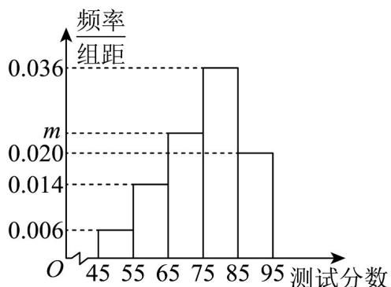

<!-- question-source:start -->
19. (17分) 云南师大附中在组织选拔数学英才班的过程中, 对高一年级的 $^{300}$ 名学生进行了一次测试.

已知参加此次测试的学生的分数 $x_{i}(i=1,2,\cdots,300)$ 全部介于 45 分到 95 分之间，学校将所有分数分成 5 组：

[45,55), [55,65), ..., [85,95], 整理得到如图所示的频率分布直方图（同组数据以这组数据的中间值作

为代表）.

(1)求 m 的值，并估计此次校内测试分数的平均值 $\overline{x}$ ；

(2)学校要求按照分数从高到低选拔首 $100$ 名的学生进行培训，试估计这 $100$ 名学生的最低分数（计算结果

保留一位小数）；

(3)试估计这 300 名学生的分数 $x_{i}(i=1,2,\cdots,300)$ 的方差 $s^{2}$ ，并判断此次得分为 63 分和 86 分的两名同学的成

绩是否进入到了 $\left[\overline{x} - s, \overline{x} + s\right]$ 范围内？

(参考公式： $s^{2}=\frac{1}{n}\sum_{i=1}^{n}f_{i}(x_{i}-\bar{x})^{2}$ ，其中 $f_{i}$ 为各组频数，参考数据： $\sqrt{129}\approx11.4$ )。
<!-- question-source:end -->

![[高中/课堂同步/题库/人教A版高中数学同步讲义(2026)/02_必修第二册/第九章 统计/第九章 统计（高效培优单元自测·提升卷）数学人教A版高一必修第二册/三_填空题/questions/answers/Q00078146A1.md]]
