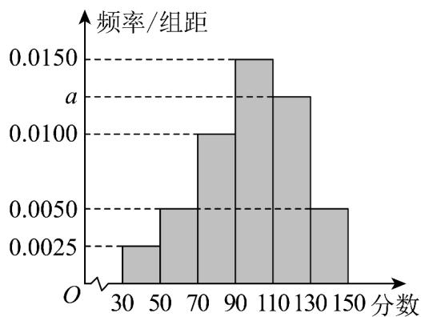

<!-- source-part:1 pages:1-50 -->

## 第九章 统计

## 内容概览

## 教学目标、教学重难点

<table><tr><td>教学目标</td><td>1.核心概念理解掌握总体、个体、样本、样本容量的定义,能区分普查与抽样调查的适用场景;理解简单随机抽样、分层抽样、系统抽样的原理与操作步骤。2.数据处理能力能对数据进行收集、整理、描述,熟练绘制频率分布表、频率分布直方图、茎叶图、散点图等图表;会计算平均数、中位数、众数、方差、标准差等统计量,并理解其统计意义。</td></tr><tr><td>教学重难点</td><td>重点1.核心概念与抽样方法重点掌握总体与样本的关系,简单随机抽样、分层抽样的操作步骤,这是统计推断的基础。2.数据描述与统计量计算核心是频率分布直方图的绘制与解读,平均数、方差的计算与意义,这是分析数据特征的关键工具。3.用样本估计总体理解样本统计量(如样本均值、样本方差)对总体的估计作用,掌握线性回归方程的建立与应用。4.统计思想的渗透体会“抽样—估计—推断”的统计思维,理解统计结论的概率性特征,避免绝对化解读难点1.抽样方法的合理选择难点在于根据总体特征(如总体是否分层、个体分布是否均匀)选择合适的抽样方法,理解分层抽样中样本量的分配原理。2.统计量的深层解读区分平均数、中位数、众数的适用场景,理解方差的“离散程度”本质;易混淆样本方差与总体方差的计算差异。3.线性回归的本质理解难点在于理解线性相关关系的“相关性”与“因果性”的区别,掌握残差分析检验模型拟合效果的方法。4.统计推断的严谨性学生易忽视样本的代表性,过度推广统计结论;需理解抽样误差的存在,学会用概率语言表述推断结果。</td></tr></table>

5. 实际问题的模型转化

难点在于将生活中的问题（如产品质量检测、高考成绩分析）转化为统计模型，设计

合理的抽样与分析方案。

## 知识清单

## 知识点 01 抽样

## 1、抽样调查

(1) 总体：统计中所考察对象的某一数值指标的全体构成的集合称为总体。

(2) 个体：构成总体的每一个元素叫做个体。

（3）样本：从总体中抽取若干个个体进行考察，这若干个个体所构成的集合叫做总体的一个样本，样本中个

体的数目叫做样本容量.

## 2、简单随机抽样

(1) 定义

一般地，设一个总体含有 $N$ 个个体，从中逐个不放回地抽取 $n$ 个个体作为样本（ $n \leq N$ ），如果每次抽取时

总体内的各个个体被抽到的机会都相等，就把这种抽样方法叫做简单随机抽样。这样抽取的样本，叫做简单

随机样本．

(2) 两种常用的简单随机抽样方法

①抽签法：一般地，抽签法就是把总体中的 $N$ 个个体编号，把号码写在号签上，将号签放在一个容器中，搅

拌均匀后，每次从中抽取一个号签，连续抽取 $n$ 次，就得到一个容量为 $n$ 的样本。

②随机数法：即利用随机数表、随机数骰子或计算机产生的随机数进行抽样．这里仅介绍随机数表法．随机

数表由数字 $^{0}$ ，1，2，…， $^{9}$ 组成，并且每个数字在表中各个位置出现的机会都是一样的。

注意：为了保证所选数字的随机性，需在查看随机数表前就指出开始数字的横、纵位置。

(3) 抽签法与随机数法的适用情况

抽签法适用于总体中个体数较少的情况，随机数法适用于总体中个体数较多的情况，但是当总体容量很大时，

需要的样本容量也很大时，利用随机数法抽取样本仍不方便。

(4) 简单随机抽样的特征

①有限性：简单随机抽样要求被抽取的样本的总体个数是有限的，便于通过样本对总体进行分析。

②逐一性：简单随机抽样是从总体中逐个地进行抽取，便于实践中操作。

③不放回性：简单随机抽样是一种不放回抽样，便于进行有关的分析和计算。

④等可能性：简单单随机抽样中各个个体被抽到的机会都相等，从而保证了抽样方法的公平。

只有四个特点都满足的抽样才是简单随机抽样。

3、分层抽样

(1) 定义

一般地，在抽样时，将总体分成互不交叉的层，然后按照一定的比例，从各层独立地抽取一定数量的个体，

将各层取出的个体合在一起作为样本，这种抽样方法叫做分层抽样。分层抽样适用于已知总体是由差异明显

的几部分组成的．

## (2) 分层抽样问题类型及解题思路

①求某层应抽个体数量：按该层所占总体的比例计算。

②已知某层个体数量，求总体容量或反之求解：根据分层抽样就是按比例抽样，列比例式进行计算.

③分层抽样的计算应根据抽样比构造方程求解，其中“抽样比==”

注意：分层抽样时，每层抽取的个体可以不一样多，但必须满足抽取 $n_{i}=n\cdot\frac{N_{i}}{N}\quad(i=1,2,\cdots,k)$ 个个体（其中

i 是层数，n 是抽取的样本容量， $N_{i}$ 是第 i 层中个体的个数，N 是总体容量）.

## 【即学即练】

1. 某高校对中文系新生进行体测，利用随机数表对 $650$ 名学生进行抽样调查，先将 $650$ 名学生进行编号：

001, 002, ..., 649, 650. 从中抽取 $^{50}$ 个样本，下面提供随机数表的第 $^{4}$ 行到第 $^{6}$ 行，若从表中第 $^{5}$ 行第 $^{6}$

列开始向右读取数据，则得到的第 $^{6}$ 个样本编号是\_\_\_\_。

32 21 18 34 29 78 64 54 07 32 52 42 06 44 38 12 23 43 56 77 35 78 90 56 42

84 42 12 53 31 34 57 86 07 36 25 30 07 32 86 23 45 78 89 07 23 68 96 08 24

32 56 78 08 43 67 89 53 55 77 34 89 94 83 75 22 53 55 78 32 45 77 89 23 45

【答案】623

【分析】根据随机表数据的读取方法确定前 $^{6}$ 个编号，即可得

【详解】按照随机数表的数据，三位一组进行读数，只取 $^{001}$ 到 $^{650}$ 内的数，重复的数只取一次。

从第 $^{5}$ 行第 $^{6}$ 列开始向右读取数据，

第一个数是 253，

第二个数是 $^{313}$ ，

第三个数是 $^{457}$ ，

下一个数是 $860$ ，不符合，

下一个数是 $736$ ，不符合，

下一个数是 $^{253}$ ，重复，不符合，

第四个数是 007，

第五个数是 $328$ ，

第六个数是 $623$

故答案为：623

2. 某大型企业对改善员工福利的 $A, B, C$ 三种方案进行了问卷调查，调查结果如下（单位：人）：

<table><tr><td></td><td>支持A方案</td><td>支持B方案</td><td>支持C方案</td></tr><tr><td>35岁以下</td><td>200</td><td>400</td><td>800</td></tr><tr><td>35岁及以上</td><td>100</td><td>100</td><td>400</td></tr></table>

则下列说法正确的是（）

A. 所有参与调查的有 $2000$ 人

B．按照年龄进行分层随机抽样，则抽取的 $^{35}$ 岁以下的人数和 $^{35}$ 岁及以上的人数之比为7:4

C．从所有参与调查的人中，按支持方案进行分层随机抽样的方法抽取 n 人，已知从支持 A 方案的人中抽

取了 $^{6}$ 人，则n=40

D．从支持 B 方案的人中，用分层随机抽样的方法抽取 $^{5}$ 人，这 $^{5}$ 人中年龄在 $^{35}$ 岁及以上的人数是 $^{4}$

【答案】AC

【分析】根据分层抽样的概念、等比例性质分析判断各项的正误·

【详解】A：由题意得，所有参与调查的人数为 $200 + 400 + 800 + 100 + 100 + 400 = 2000$ ，对；

B : 35 岁以下的人数为 1400 , 35 岁及以上的人数为 600 ,

所以按照年龄进行分层随机抽样，抽取 $^{35}$ 岁以下的人数和 $^{35}$ 岁及以上的人数之比为 $1400:600=7:3$ ，错；

C：从所有参与调查的人中，按支持方案进行分层随机抽样的方法抽取 $n$ 人，

已知从支持 A 方案的人中抽取了 6 人，则 $\frac{6}{100+200}=\frac{n}{2000}$ ，解得 n=40，对；

D：从支持 B 方案的人中，用分层随机抽样的方法抽取 5 人，年龄在 35 岁及以上的人数为 $\frac{5}{500} \times 100 = 1$ ，错.

故选：AC

## 知识点 02 用样本估计总体

1、频率分布直方图

(1) 频率、频数、样本容量的计算方法

①×组距 = 频率 .

② = 频率，= 样本容量，样本容量×频率 = 频数。

③频率分布直方图中各个小方形的面积总和等于1.

## 2、频率分布直方图中数字特征的计算

(1) 最高的小长方形底边中点的横坐标即是众数.

（2）中位数左边和右边的小长方形的面积和是相等的．设中位数为 $x$ ，利用 $x$ 左（右）侧矩形面积之和等于

0.5，即可求出 $x$ ：

（3）平均数是频率分布直方图的“重心”，等于频率分布直方图中每个小长方形的面积乘以小长方形底边中点的横坐标之和，即有 $\overline{x}=x_{1}p_{1}+x_{1}p_{1}+\cdots+x_{n}p_{n}$ ，其中 $x_{n}$ 为每个小长方形底边的中点， $p_{n}$ 为每个小长方形的面积．

## 3、百分位数

(1) 定义

一组数据的第 $p$ 百分位数是这样一个值，它使得这组数据中至少有 $p\%$ 的数据小于或等于这个值，且至少有 $(100 - p)\%$ 的数据大于或等于这个值。

(2) 计算一组 $n$ 个数据的的第 $p$ 百分位数的步骤

①按从小到大排列原始数据.

②计算 $i=n\times p\%$ .

③ 若 $i$ 不是整数而大于 $i$ 的比邻整数 $j$ ，则第 $p$ 百分位数为第 $j$ 项数据；若 $i$ 是整数，则第 $p$ 百分位数为第 $i$ 项与第 $i + 1$ 项数据的平均数。

(3) 四分位数

我们之前学过的中位数，相当于是第 $^{50}$ 百分位数．在实际应用中，除了中位数外，常用的分位数还有第 $^{25}$ 百分位数，第 $^{75}$ 百分位数．这三个分位数把一组由小到大排列后的数据分成四等份，因此称为四分位数．

## 4、样本的数字特征

(1) 众数、中位数、平均数

①众数：一组数据中出现次数最多的数叫众数，众数反应一组数据的多数水平。

②中位数：将一组数据按大小顺序依次排列，把处在最中间位置的一个数据（或最中间两个数据的平均数）

叫做这组数据的中位数，中位数反应一组数据的中间水平。

③平均数：n 个样本数据 $x_{1}, x_{2}, \cdots, x_{n}$ 的平均数为 $\overline{x} = \frac{x_{1} + x_{2} + \cdots + x_{n}}{n}$ ，反应一组数据的平均水平，公式变形： $\sum_{i=1}^{n}x_{i}=n\overline{x}$

## 5、标准差和方差

(1) 定义

①标准差：标准差是样本数据到平均数的一种平均距离，一般用 s 表示．假设样本数据是 $x_{1}, x_{2}, \cdots, x_{n}$ ， $\bar{x}$ 表示

这组数据的平均数，则标准差 $s=\sqrt{\frac{1}{n}\left[(x_{1}-\bar{x})^{2}+(x_{2}-\bar{x})^{2}+\cdots+(x_{n}-\bar{x})^{2}\right]}$

②方差：方差就是标准差的平方，即 $s^{2}=\frac{1}{n}\left[(x_{1}-\bar{x})^{2}+(x_{2}-\bar{x})^{2}+\cdots+(x_{n}-\bar{x})^{2}\right]$ 。显然，在刻画样本数据的分

散程度上，方差与标准差是一样的．在解决实际问题时，多采用标准差．

(2) 数据特征

标准差、方差描述了一组数据围绕平均数波动程度的大小．标准差、方差越大，则数据的离散程度越大；标

准差、方差越小，数据的离散程度越小．反之亦可由离散程度的大小推算标准差、方差的大小．

## (3) 平均数、方差的性质

如果数据 $x_{1}, x_{2}, \ldots, x_{n}$ 的平均数为 $\overline{x}$ ，方差为 $s^{2}$ ，那么

①一组新数据 $x_{1} + b, x_{2} + b, \ldots, x_{n} + b$ 的平均数为 $\overline{x} + b$ ，方差是 $s^{2}$

②一组新数据 $ax_{1}, ax_{2}, \ldots, ax_{n}$ 的平均数为 $a\overline{x}$ ，方差是 $a^{2}s^{2}$

③一组新数据 $ax_{1} + b, ax_{2} + b, \ldots, ax_{n} + b$ 的平均数为 $a\overline{x} + b$ ，方差是 $a^{2}s^{2}$ 。

## 【即学即练】

1. 某班 $^{50}$ 个同学的数学成绩构成一组数据，这组数据的每个数依次减去它们的平均数，得到另一组新数据。

则（ ）A.新数据与原数据的平均数相同 B.新数据与原数据的方差相同C.新数据与原数据的中位数相同 D.新数据与原数据的极差相同

【答案】BD

【分析】根据平均数、方差、中位数、极差的定义逐一判断即可·

【详解】设 50 个同学的数学成绩构成一组数据（原）数据： $x_{1}, x_{2}, \cdots, x_{50}$

它们的平均数为 $\overline{x}$ （由实际意义可知 $\overline{x} \neq 0$ ），方差为 $s^2$ ，

得到的新数据为： $x_{1}-\bar{x},x_{2}-\bar{x},\cdots,x_{50}-\bar{x}$ ，它们的平均数为 $\bar{x}-\bar{x}=0$ ，A 错误；

新数据的方差： $s_{1}^{2}=\frac{\left(x_{1}-\bar{x}-0\right)^{2}+\left(x_{2}-\bar{x}-0\right)^{2}+\cdots+\left(x_{50}-\bar{x}-0\right)^{2}}{50}=\frac{\left(x_{1}-\bar{x}\right)^{2}+\left(x_{2}-\bar{x}\right)^{2}+\cdots+\left(x_{50}-\bar{x}\right)^{2}}{50}=s^{2}$ ，B

正确；

因为 $\overline{x} \neq 0$ ，所以新数据与原数据的中位数相差 $\overline{x}$ ，C 错误；

新数据与原数据的极差相同， $^{D}$ 正确·

故选：BD

2. 某校高二年级半期考试后，为了解本次考试的情况，在整个年级中随机抽取了 $^{200}$ 名学生的数学成绩，将

成绩分为 $[30,50), [50,70), [70,90), [90,110), [110,130), [130,150]$ ，共 $6$ 组，得到如图所示的频率分布直方图。

(1)求实数 $a$ 的值.

(2)在样本中，采取按比例分层抽样的方法从成绩在[90,150]内的学生中抽取13名，问其中成绩在[130,150]的

学生有几名？

(3)根据图中的样本数据，假设同组中每个数据用该组区间的中点值代替，试估计本次考试的平均分

【答案】(1)0.0125

(2)2

(3)98

【分析】 $^{1}$ 根据频率和为 $^{1}$ 求 a 的值·

(2) 根据分层抽样的方法求解·

(3) 利用频率分布直方图估计平均数即可·

【详解】（ $^{1}$ ）由频率分布直方图知：

$$
(0. 0 0 2 5 + 0. 0 0 5 \times 2 + 0. 0 1 + a + 0. 0 1 5) \times 2 0 = 1
$$

解得 a = 0.0125 .

(2) 采取分层抽样， $[130,150]$ 的学生个数为： $\frac{0.005}{0.005+0.015+0.0125}\times13=2$

即成绩在 $[130,150]$ 的学生有2名.

(3) 由频率分布直方图知：平均数为：

$$
\left(4 0 \times 0. 0 0 2 5 + 6 0 \times 0. 0 0 5 + 8 0 \times 0. 0 1 + 1 0 0 \times 0. 0 1 5 + 1 2 0 \times 0. 0 1 2 5 + 1 4 0 \times 0. 0 0 5\right) \times 2 0 = 9 8
$$

## 题型精讲

![[高中/课堂同步/题库/人教A版高中数学同步讲义(2026)/02_必修第二册/第九章 统计/第九章 统计（高效培优讲义）数学人教A版高一必修第二册/题型01_随机抽样_分层抽样/题型01_随机抽样_分层抽样.md]]
![[高中/课堂同步/题库/人教A版高中数学同步讲义(2026)/02_必修第二册/第九章 统计/第九章 统计（高效培优讲义）数学人教A版高一必修第二册/题型02_频率分布直方图_条形统计图_折线统计图_扇形统计图/题型02_频率分布直方图_条形统计图_折线统计图_扇形统计图.md]]
![[高中/课堂同步/题库/人教A版高中数学同步讲义(2026)/02_必修第二册/第九章 统计/第九章 统计（高效培优讲义）数学人教A版高一必修第二册/题型03_百分位数/题型03_百分位数.md]]
![[高中/课堂同步/题库/人教A版高中数学同步讲义(2026)/02_必修第二册/第九章 统计/第九章 统计（高效培优讲义）数学人教A版高一必修第二册/题型04_样本的数字特征/题型04_样本的数字特征.md]]
![[高中/课堂同步/题库/人教A版高中数学同步讲义(2026)/02_必修第二册/第九章 统计/第九章 统计（高效培优讲义）数学人教A版高一必修第二册/强化训练/强化训练.md]]
