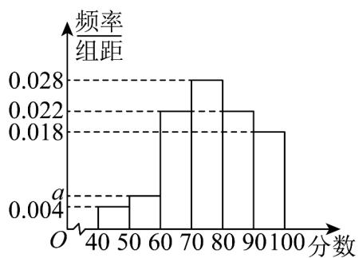

<!-- question-source:start -->
6. 某校抽取 $100$ 名高二学生期中考试的语文成绩，绘制频率分布直方图（如图所示），其中样本数据分组区

间为： $[40,50)$ ， $[50,60)$ ，…， $[80,90)$ ， $[90,100]$

(1)求频率分布直方图中 $a$ 的值；

(2)根据频率分布直方图，估计这 $^{100}$ 名学生语文成绩的中位数和平均数。（保留小数点后 $^{1}$ 位）
<!-- question-source:end -->

![[高中/课堂同步/题库/人教A版高中数学同步讲义(2026)/02_必修第二册/第九章 统计/第九章 统计（高效培优讲义）数学人教A版高一必修第二册/强化训练/questions/answers/Q00078170A1.md]]
