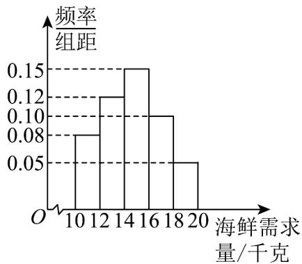

<!-- question-source:start -->
14. 某商店销售海鲜，现统计了该商店今年国庆、中秋双节前后 $^{50}$ 天该海鲜每天的需求量 $x$ ( $10 \leq x \leq 20$

单位：千克）得频率分布直方图如右·已知该商店每天进该海鲜一次，商店每销售 $^{1}$ 千克，可获利 $^{50}$ 元，若

供大于求，剩余的低价处理，每处理 $^{1}$ 千克，亏损 $^{10}$ 元；若供不应求，可以从其他商店调拨，每销售 $^{1}$ 千克

获利 $^{30}$ 元·假设该商店每天进海鲜 $^{14}$ 千克，商店的日利润为 $^{y}$ （单位：元）·

(1)求该商店的日利润 $y$ 关于需求量 $x$ 的函数表达式；

(2)假设每一组数据的均值用同一组数据区间的中点值代替，视频率为概率·

①求这 $^{50}$ 天该商店销售海鲜的日利润的平均数；

②估计日利润在区间 $\left[580,760\right)$ 内的概率.
<!-- question-source:end -->

![[高中/课堂同步/题库/人教A版高中数学同步讲义(2026)/02_必修第二册/第九章 统计/第九章 统计（高效培优讲义）数学人教A版高一必修第二册/强化训练/questions/answers/Q00078175A1.md]]
