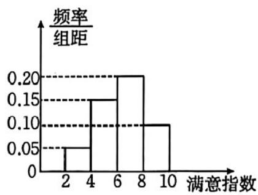
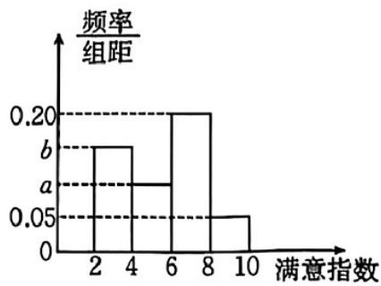

> [!faq]- 《第九章 统计（高效培优讲义）数学人教A版高一必修第二册》官方解析
>
> > [!success]- **【答案】** A. 这组数据的上四分位数为 8.5 B. 这组数据没有众数 C. 这组数据的极差为 6 D. 这组数据的平均数为 6
>
> > [!note]- **【分析】**
> > 根据给定条件，结合上四分位数、众数、极差、平均数的意义依次判断即可·
>
> > [!note]- **【解析】**
> > 对于 $^{A}$ ，将给定数据从小到大排列为3，3，4，5，7，8，9，9，而 $8\times75\%=6$ ，
> >
> > 所以这组数据的上四分位数为 $\frac{8 + 9}{2} = 8.5$ ，故A正确；
> >
> > 对于 B，这组数据的众数是 $^{3}$ 和 $^{9}$ ，故 B 错误；
> >
> > 对于 $C$ ，这组数据的极差为 $6$ ，故 $C$ 正确；
> >
> > 对于 $^{D}$ ，这组数据的平均数为 $\frac{3+3+4+5+7+8+9+9}{8}=6$ ，故 $^{D}$ 正确。
> >
> > 故选：ACD.
> >
> > 3. 为了解学生对 $A, B$ 两家餐厅的满意度情况，现从在 $A, B$ 两家餐厅都用过餐的学生中随机抽取了50人，
> >
> > 每人分别对这两家餐厅的满意度进行打分（分数区间为 $[2,10]$ ），将其分数记为满意指数·根据打分结果按
> >
> > $[2,4), [4,6), [6,8), [8,10]$ 分组，得到如图所示的频率分布直方图，其中 $B$ 餐厅的满意指数在 $[2,4)$ 内的学生有
> >
> > 15 人.
> >
> > 
> > A餐厅满意指数频率分布直方图
> >
> > 
> > B餐厅满意指数频率分布直方图
> >
> > (1)求图中 $a, b$ 的值；
> >
> > (2)利用样本估计总体的思想，比较 $A$ ， $B$ 两家餐厅满意指数的平均数的大小；（计算平均数时同一组中的数
> >
> > 据用该组区间的中点值作代表）
> >
> > (3)若 $B$ 餐厅满意指数频率分布直方图中第三组满意指数的方差为 $2$ ，第四组满意指数的方差为 $1$ ，估计在 $B$
> >
> > 餐厅用过餐的第三组与第四组所有学生的满意指数的方差·（计算平均数时同一组中的数据用该组区间的中点
> >
> > 值作代表）
> >
> > 附：若数据 $x_{1}, x_{2}, \cdots, x_{m}$ 的平均数为 $\overline{x}$ ，方差为 $s_{1}^{2}$ ，数据 $y_{1}, y_{2}, \cdots, y_{n}$ 的平均数为 $\overline{y}$ ，方差为 $s_{2}^{2}$ ，将这两组数据混
> >
> > 合在一起得到一组新数据，设新数据的平均数为 $\overline{z}$ ，则新数据的方差
> >
> > $$
> > s ^ {2} = \frac {m}{m + n} \left[ s _ {1} ^ {2} + (\overline {{z}} - \overline {{x}}) ^ {2} \right] + \frac {n}{m + n} \left[ s _ {2} ^ {2} + (\overline {{z}} - \overline {{y}}) ^ {2} \right].
> > $$
> >
> > 【答案】(1) a = 0.10, b = 0.15;
> >
> > (2) A 餐厅满意指数的平均数大于 B 餐厅满意指数的平均数
> >
> > (3) $\frac{61}{25}$
> >
> > 【分析】（1）根据频率分布直方图的频率和为 $^{1}$ 的性质，结合已知参数值求解a,b；
> >
> > (2) 利用组中点值与对应频率的乘积和计算两个餐厅满意指数的平均数，并比较大小；
> >
> > (3) 先确定两组数据的人数，再根据混合数据的平均数和方差公式分步计算
> >
> > 【详解】（1）B餐厅样本容量为50， $[2,4)$ 区间频数为15，对应频率为 $\frac{15}{50}=0.3$
> >
> > 频率分布直方图组距为 $2$ ，故 $2b = 0.3, b = 0.15$
> >
> > 所有区间频率和为 $2 \times (b + 0.20 + a + 0.05) = 1$ ，即 $a + b + 0.25 = 0.5$ ，解得 $a = 0.1$ .
> >
> > (2) A 餐厅满意指数平均数 $\overline{x}_{A}=3\times0.1+5\times0.3+7\times0.4+9\times0.2=6.4$
> >
> > B 餐厅满意指数平均数 $\overline{x}_{B}=3\times0.3+5\times0.2+7\times0.4+9\times0.1=5.6$
> >
> > 故 $\overline{x}_A > \overline{x}_B$
> >
> > (3) B 餐厅第三组 $[6,8)$ 频率为 0.4，人数为 $50 \times 0.4 = 20$ ，平均数 7，方差 2；
> >
> > 第四组 $[8,10]$ 人数为 $50 \times 0.1 = 5$ ，平均数 $9$ ，方差 $1$ .
> >
> > 混合数据平均数 $\overline{z}=\frac{20\times7+5\times9}{20+5}=\frac{37}{5}$
> >
> > $$
> > s ^ {2} = \frac {2 0}{2 5} \left[ 2 + \left(\frac {3 7}{5} - 7\right) ^ {2} \right] + \frac {5}{2 5} \left[ 1 + \left(\frac {3 7}{5} - 9\right) ^ {2} \right] = \frac {4}{5} \left(2 + \frac {4}{2 5}\right) + \frac {1}{5} \left(1 + \frac {6 4}{2 5}\right) = \frac {3 0 5}{1 2 5} = \frac {6 1}{2 5}.
> > $$
