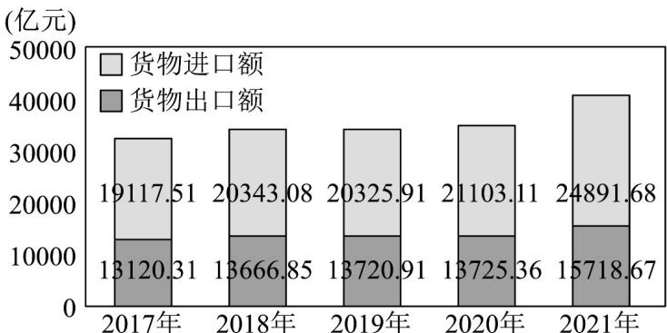
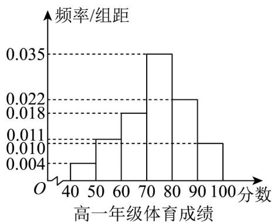
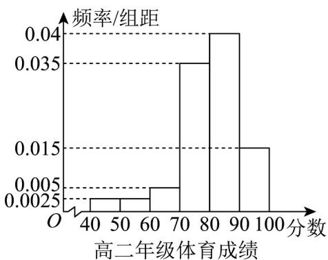
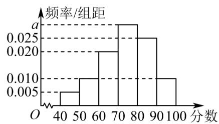

> [!faq]- 《第九章 统计（高效培优讲义）数学人教A版高一必修第二册》官方解析
>
> > [!success]- **【答案】**  2017-2021年上海市货物进出口总额 A. 从 $2018$ 年开始后，图表中最后一年增长率最大； B. 从 $2018$ 年开始后，进出口总额逐年增大； C. 从 $2018$ 年开始后，进口总额逐年增大； D．从 2018 年开始后，图表 2020 年增长率最小.
>
> > [!note]- **【分析】**
> > 利用图象数据分析选项即可.
>
> > [!note]- **【解析】**
> > 根据图象可以发现：2018 年到 2019 年进口总额是降低的，故 C 错误.
> >
> > 故选：C
> >
> > 12. 学校分别对高一年级和高二年级开展体育水平抽样测试，测试成绩数据处理后，得到如下频率分布直方
> >
> > 图，则下面说法正确的是()
> >
> > 
> >
> > 
> >
> > A. 样本中高二年级成绩的众数是 $^{85}$ B. 样本中高二年级成绩在 $^{80}$ 分以上的频率高于高一年级成绩在 $^{80}$ 分以上的频率
> > C. 样本中高二年级成绩的方差高于高一年级成绩的方差
> > D. 样本中高二年级成绩的中位数高于高一年级成绩的中位数
> >
> > 【答案】ABD
> >
> > 【分析】根据频率分布直方图的众数、平均数、方差、中位数、频率等逐项分析判断即可得结论·
> >
> > 【详解】对于 $^{A}$ ，由高二年级学生成绩的频率分布直方图，高二年级学生成绩的众数位于区间 $^{[80,90]}$ 的中点
> >
> > 横坐标，所以众数为 $^{85}$ ，故 $^{A}$ 正确；
> >
> > 对于 $B$ ，由样本中高二年级成绩在80分以上的人数的频率为 $(0.04 + 0.015)\times 10 = 0.55$
> >
> > 高一年级成绩在 $^{80}$ 分以上的人数的频率为 $(0.022 + 0.010) \times 10 = 0.32$ ，
> >
> > 所以高二年级成绩在 $^{80}$ 分以上的频率高于高一年级成绩在 $^{80}$ 分以上的频率，故 $^{B}$ 正确；对于 $^{C}$ ，由频率分布
> >
> > 直方图，可得高一学生成绩的平均数为 $(45\times 0.004 + 55\times 0.011 + 65\times 0.018 + 75\times 0.035 + 85\times 0.022 + 95\times 0.010)\times 10$
> >
> > =74
> >
> > 则高一学生成绩的方差为 $s_1^2 = (45 - 74)^2 \times 0.04 + (55 - 74)^2 \times 0.11 + (65 - 74)^2 \times 0.18 + (75 - 74)^2 \times 0.35 + (85 - 74)^2 \times 0.04$
> >
> > $74)^{2}\times 0.22 + (95 - 74)^{2}\times 0.10 = 159$
> >
> > 高二学生成绩的平均数为 $(45\times 0.0025 + 55\times 0.0025 + 65\times 0.005 + 75\times 0.035 + 85\times 0.04 + 95\times 0.015)\times 10 = 80.25$
> >
> > 可得高二学生成绩的方差为 $s_2^2 = (45 - 80.25)^2 \times 0.025 + (55 - 80.25)^2 \times 0.025 + (65 - 80.25)^2 \times 0.05 + (75 - 80.25)^2 \times 0.025$
> >
> > $$
> > 8 0. 2 5) ^ {2} \times 0. 3 5 + (8 5 - 8 0. 2 5) ^ {2} \times 0. 4 + (9 5 - 8 0. 2 5) ^ {2} \times 0. 1 5 \approx 1 1 0
> > $$
> >
> > 所以样本中高二年级成绩的方差低于高一年级成绩的方差，故 $^{C}$ 不正确；
> >
> > 对于 $^{D}$ ，由高一学生成绩的频率分布直方图，可得其中前 $^{3}$ 个矩形的面积和为 $(0.004 + 0.011 + 0.018) \times 10 =$
> >
> > 0.33
> >
> > 前 $^{4}$ 个矩形的面积和为 $(0.004 + 0.011 + 0.018 + 0.035) \times 10 = 0.68$ ，所以高一学生成绩的中位数位于 $[70,80]$ 之间，设中位数为 $x_{1}$ ，则 $x_{1} = 70 + \frac{0.17}{0.35} \times 10 = 74.86$ ，由
> >
> > 高二学生成绩的频率分布直方图，可得其中前 $^{4}$ 个矩形的面积和为 $(0.0025 + 0.0025 + 0.005 + 0.035) \times 10 = 0.45$ ，
> >
> > 前 $^{5}$ 个矩形的面积和为 $(0.0025 + 0.0025 + 0.005 + 0.035 + 0.04) \times 10 = 0.85$ ，所以高二学生成绩的中位数位于 $[80,90]$ 之间，
> >
> > 设中位数为 $x_{2}$ ，则 $x_{2} = 80 + \frac{0.05}{0.4} \times 10 = 81.25$ ，
> >
> > 其中 $^{74.86 < 81.25}$ ，所以样本中高二年级成绩的中位数高于高一年级成绩的中位数，所以 $^{D}$ 正确.
> >
> > 故选：ABD.
> >
> > 13．文明城市是反映城市整体文明水平的综合性荣誉称号，作为普通市民，既是文明城市的最大受益者，更是文明城市的主要创造者·某市为提高市民对文明城市创建的认识，举办了“创建文明城市”知识竞赛，从所有答卷中随机抽取 $^{100}$ 份作为样本，将样本的成绩（满分 $^{100}$ 分，成绩均为不低于 $^{40}$ 分的整数）分成六段： $[40,50)$ ， $[50,60)$ ，…， $[90,100]$ ，得到如图所示的频率分布直方图·
> >
> > 频率/组距
> > a
> > 0.025
> > 0.020
> > 0.010
> > 0.005
> > O 40 50 60 70 80 90 100 分数
> >
> > 
> >
> > (1)求频率分布直方图中 $a$ 的值及样本成绩的中位数；
> >
> > (2)已知落在 $[50,60)$ 的平均成绩是 $^{54}$ ，方差是 $^{7}$ ，落在 $[60,70)$ 的平均成绩为 $^{66}$ ，方差是 $^{4}$ ，求两组成绩合并
> >
> > 后的平均数 $\overline{z}$ 和方差 $s^2$
> >
> > 【答案】(1) $a = 0.030$ ，75
> >
> > (2)62,37
> >
> > 【分析】（1）根据每组小矩形的面积之和为 $^{1}$ 即可求解；由频率分布直方图求中位数的计算公式即可求解；
> >
> > (2 利用平均数和方差的计算公式即可求解·
> >
> > 【详解】（1）因为每组小矩形的面积之和为 $^{1}$ ，
> >
> > 所以 $\left(0.005 + 0.010 + 0.020 + a + 0.025 + 0.010\right) \times 10 = 1$
> >
> > 则 a = 0.030 .
> >
> > 成绩落在 $[40,70)$ 内的频率为 $(0.005 + 0.010 + 0.020)\times 10 = 0.35$
> >
> > 成绩落在 $[40,80)$ 内的频率为 $(0.005 + 0.010 + 0.020 + 0.030) \times 10 = 0.65$
> >
> > 设中位数为 $m$ ，
> >
> > 由 $0.35 + (m - 70) \times 0.030 = 0.50$ ，得 m = 75，故中位数为 75.
> >
> > (2) 由图可知，成绩在 $[50,60)$ 的市民人数为 $100 \times 0.1 = 10$ ，
> >
> > 成绩在 $\left[60,70\right)$ 的样本人数为 $100\times0.2=20$ ，
> >
> > 故这两组成绩的总平均数为 $\frac{-z}{z} = \frac{10\times 54 + 66\times 20}{10 + 20} = 62$
> >
> > 由样本方差计算总体方差公式可得总方差为：
> >
> > $$
> > \mathrm{s} ^ {2} = \frac {1 0}{3 0} \times \left[ 7 + (5 4 - 6 2) ^ {2} \right] + \frac {2 0}{3 0} \times \left[ 4 + (6 6 - 6 2) ^ {2} \right] = 3 7.
> > $$
