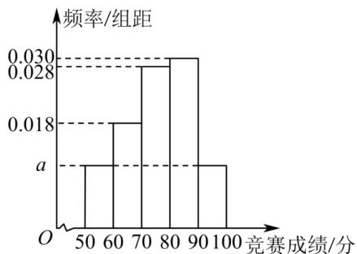

<!-- question-source:start -->
【典例2】某中学举行了一次“校园学科知识竞赛”，为了了解本次竞赛成绩情况，从中抽取了 $100$ 名学生的竞

赛成绩（单位：分，得分取正整数，满分为 $100$ 分）作为样本进行统计，将成绩整理后，按

$[50,60), [60,70), [70,80), [80,90), [90,100]$ 分成 $^5$ 组，得到如图所示的频率分布直方图。

(1)求 $a$ 的值；

(2)估计这次竞赛成绩的平均分（各组数据以该组区间的中点值作代表）；

(3)若该中学计划奖励竞赛成绩前 $15\%$ 的学生，求获得奖励的学生竞赛成绩的最低分。
<!-- question-source:end -->

![[高中/课堂同步/题库/人教A版高中数学同步讲义(2026)/02_必修第二册/第九章 统计/第九章 统计（高效培优讲义）数学人教A版高一必修第二册/题型02_频率分布直方图_条形统计图_折线统计图_扇形统计图/questions/answers/Q00078153A1.md]]
