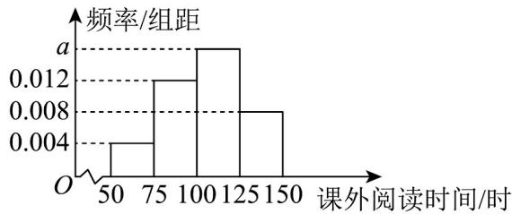

<!-- question-source:start -->
【变式1】课外阅读有很多好处，可以帮助学生提高阅读能力、拓展知识面、提高思维能力等．某校为了解
学生课外阅读的情况，随机统计了 n 名学生一个学期的课外阅读时间（单位：时），所得数据都在 $[50,150]$ 内，将所得的数据分成 $^{4}$ 组： $\left[50,75\right)$ ， $\left[75,100\right)$ ， $\left[100,125\right)$ ， $\left[125,150\right]$ ，得到如图所示的频率分布直方图，
现知道课外阅读时间在 $\left[125,150\right]$ 内的有80人.

(1)求 n 和 a 的值；

(2)估计该校学生一个学期课外阅读时间的平均数（同一组中的数据用该组区间的中点值代表）；

(3)估计该校学生一个学期课外阅读时间的中位数.
<!-- question-source:end -->

![[高中/课堂同步/题库/人教A版高中数学同步讲义(2026)/02_必修第二册/第九章 统计/第九章 统计（高效培优讲义）数学人教A版高一必修第二册/题型02_频率分布直方图_条形统计图_折线统计图_扇形统计图/questions/answers/Q00078154A1.md]]
