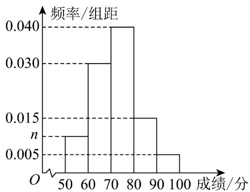

<!-- question-source:start -->
【变式3】2025年4月24日，神舟二十号载人飞船在长二遥二十运载火箭的托举下，圆满完成飞行任务。

为发扬并传承中国航天精神，我市随机抽取 $^{600}$ 名学生进行航天知识竞赛并记录学生的成绩（满分 $^{100}$ 分），

将学生的成绩整理后分成五组，从左到右依次记为 $[50,60)$ ， $[60,70)$ ， $[70,80)$ ， $[80,90)$ ， $[90,100]$ ，并绘制

成如图所示的频率分布直方图.

(1)求 $n$ 的值；

(2)求第 $70$ 百分位数；

(3)求这 600 名学生成绩的平均数（同一组数据用该组区间的中点值作代表）
<!-- question-source:end -->

![[高中/课堂同步/题库/人教A版高中数学同步讲义(2026)/02_必修第二册/第九章 统计/第九章 统计（高效培优讲义）数学人教A版高一必修第二册/题型02_频率分布直方图_条形统计图_折线统计图_扇形统计图/questions/answers/Q00078156A1.md]]
