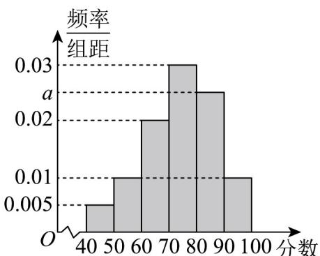

<!-- question-source:start -->
【变式3】某地举办了“防电信诈骗”知识竞赛，从所有答卷中随机抽取 $^{100}$ 份作为样本，将样本的成绩（满分

100 分，成绩均为不低于 40 分的整数）分成六段： $\left[40,50\right),\left[50,60\right),\ldots,\left[90,100\right]$ ，得到如图所示的频率分布直

方图·

(1)求频率分布直方图中 a 的值及样本成绩的第 $^{80}$ 百分位数；求样本平均数；

(2)已知落在区间 $[50,60)$ 的样本平均成绩是 $57$ ，标准差是 $7$ ，落在区间 $[60,70)$ 的样本平均成绩为 $66$ ，标准差

是 $^{4}$ ，求两组样本成绩合并后的平均数 $\overline{z}$ 和方差 $s^{2}$ .
<!-- question-source:end -->

![[高中/课堂同步/题库/人教A版高中数学同步讲义(2026)/02_必修第二册/第九章 统计/第九章 统计（高效培优讲义）数学人教A版高一必修第二册/题型04_样本的数字特征/questions/answers/Q00078166A1.md]]
