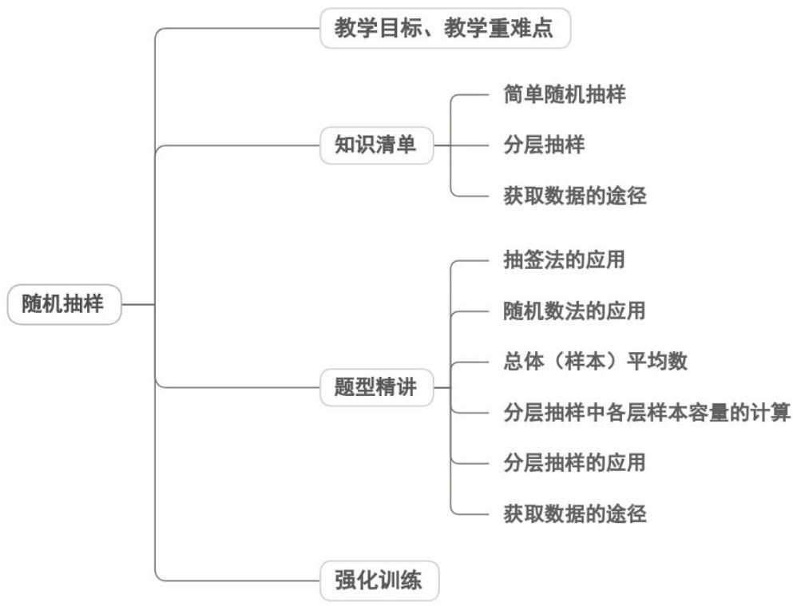

## 专题9.1 随机抽样



## 教学目标、教学重难点

<table><tr><td>教学目标</td><td>1.理解总体、个体、样本、样本容量的核心概念,能区分普查与抽样调查的适用场景,明确抽样调查的必要性与合理性。2.掌握简单随机抽样的定义与本质特征,能辨析放回与不放回简单随机抽样的区别,知晓实际应用中以不放回抽样为主的原因。3.熟练掌握抽签法、随机数法的具体操作步骤,能根据总体规模、可操作性等条件选择合适的抽样方法实施抽样。4.理解总体均值与样本均值的定义及关系,掌握样本均值的计算方法,能运用样本均值估计总体均值,了解样本量对估计精度的影响。</td></tr><tr><td>教学重难点</td><td>1.重点抽样方法的实操掌握:抽签法(编号、制签、搅拌、抽签、取个体)与随机数法(编</td></tr></table>

```txt
号、选起始数、取数、筛选样本）的完整操作流程。
2.难点
统计推断的随机性认知：理解样本均值的随机性（不同样本可能得到不同结果），以及样本量与估计精度的辩证关系（样本量越大精度越高，但需兼顾成本）。
```
