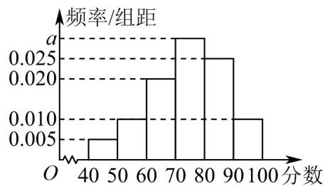

<!-- question-source:start -->
【变式3】某市为提高市民对文明城市创建的认识，举办了“创建文明城市”知识竞赛，从所有答卷中随机抽

取 $^{100}$ 份作为样本，将样本的成绩（满分 $^{100}$ 分，成绩均为不低于 $^{40}$ 分的整数）分成六段：

[40,50), [50,60), ..., [90,100] 得到如图所示的频率分布直方图.

(1)求频率分布直方图中 a 的值；

(2)求样本成绩的上四分位数；

(3)已知落在 $[50,60)$ 的平均成绩是 $^{57}$ ，方差是 $^{7}$ ，落在 $[60,70)$ 的平均成绩为 $^{69}$ ，方差是 $^{4}$ ，求两组成绩的总平

均数 $\overline{z}$ 和总方差 $s^{2}$
<!-- question-source:end -->

![[高中/课堂同步/题库/人教A版高中数学同步讲义(2026)/02_必修第二册/第九章 统计/讲义/专题9_2_用样本估计总体_高效培优讲义_数学人教A版高一必修第二册/_compact/answers/Q00064872A1.md]]
