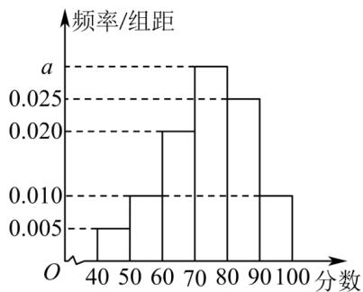

<!-- question-source:start -->
【变式1】某学校组织高二数学挑战赛，现从参加挑战赛的学生中随机选取100人，将其成绩（百分制）分

成 $[40,50)$ ， $[50,60)$ ，…， $[90,100]$ 六组，得到频率分布直方图（如下图），请完成下列问题：

(1)求频率分布直方图中 $a$ 的值，并估计参加挑战赛的学生成绩的 $80\%$ 分位数；

(2)已知落在区间 $[60,70)$ 的样本平均分是63，方差是5；落在区间 $[70,80)$ 的样本平均分是78，方差是4，求

两组样本成绩合并后的平均分 x 和方差 $s^{2}$

附：若数据 $x_{1}, x_{2}, \cdots, x_{m}$ 的平均数为 $\bar{x}$ ，方差为 $s_{1}^{2}$ ，数据 $y_{1}, y_{2}, \cdots, y_{n}$ 的平均数为 $\bar{y}$ ，方差为 $s_{2}^{2}$ ，将这两组数据混

合在一起得到一组新数据，设新数据的平均数为 $\overline{z}$ ，则新数据的方差

$$
s ^ {2} = \frac {m}{m + n} \left[ s _ {1} ^ {2} + (\overline {{z}} - \overline {{x}}) ^ {2} \right] + \frac {n}{m + n} \left[ s _ {2} ^ {2} + (\overline {{z}} - \overline {{y}}) ^ {2} \right].
$$
<!-- question-source:end -->

![[高中/课堂同步/题库/人教A版高中数学同步讲义(2026)/02_必修第二册/第九章 统计/讲义/专题9_2_用样本估计总体_高效培优讲义_数学人教A版高一必修第二册/_compact/answers/Q00064873A1.md]]
