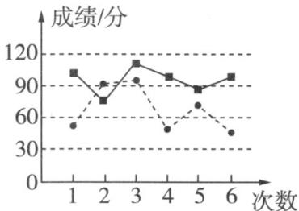

<!-- question-source:start -->
【变式1】已知甲、乙两名同学在高二的 $^{6}$ 次数学周测的成绩（单位：分）统计如图，则下列说法不正确的

是（ ）

A. 甲成绩的中位数小于乙成绩的中位数
B. 若甲、乙成绩的平均数分别为 $\overline{x_{1}}$ ， $\overline{x_{2}}$ ，则 $\overline{x_{1}} > \overline{x_{2}}$ C. 甲成绩的极差小于乙成绩的极差
D. 甲成绩比乙成绩稳定
<!-- question-source:end -->

![[高中/课堂同步/题库/人教A版高中数学同步讲义(2026)/02_必修第二册/第九章 统计/讲义/专题9_2_用样本估计总体_高效培优讲义_数学人教A版高一必修第二册/_compact/answers/Q00064876A1.md]]
