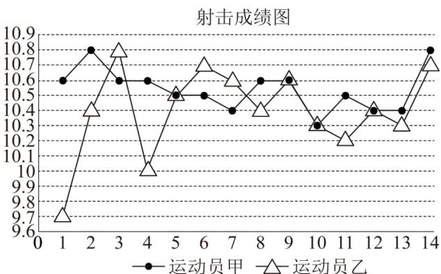

<!-- question-source:start -->
【变式2】2024 年巴黎奥运会中国代表队获得金牌榜第一，奖牌榜第二的优异成绩．首金是由中国两名运动

员（记为甲、乙）组成的组合在 $^{10}$ 米气步枪混合团体赛中获得，两人在决赛中 $^{14}$ 次射击环数如图，则（

A. 运动员甲的平均射击环数低于 10.6
B. 运动员乙射击环数的 80% 分位数和众数均为 10.4
C. 运动员甲射击环数的标准差小于运动员乙射击环数的标准差
D. 运动员乙射击环数的极差小于运动员甲射击环数的极差
<!-- question-source:end -->

![[高中/课堂同步/题库/人教A版高中数学同步讲义(2026)/02_必修第二册/第九章 统计/讲义/专题9_2_用样本估计总体_高效培优讲义_数学人教A版高一必修第二册/_compact/answers/Q00064877A1.md]]
