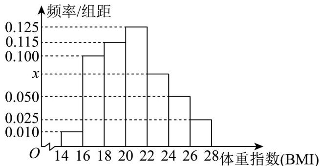

<!-- question-source:start -->
【变式2】我们知道，身体质量指数BMI是衡量人体胖瘦程度以及是否健康的重要指标，根据《国家学生体

质健康标准》（2014年修订），中国高中男生BMI的正常值为： $16.5 \sim 23.8$ 。某市抽取了 $^{1000}$ 名高中男生的

BMI 值进行调查，调查结果的频率分布直方图如图所示。

(1)求 $x$ 的值，并估计该市高中男生BMI值的众数；

(2)一般地，以第 $^{5}$ 百分位数到第 $^{85}$ 百分位数作为BMI的正常值，试估计该市高中男生BMI的正常值，并比

较与中国高中男生BMI的正常值是否存在差异？若存在，请从统计知识的角度说明引起差异的原因；

(3)已知落在区间[22,24)的BMI值的平均数为 $^{23}$ ，方差为0.2，落在区间[24,26)的BMI值的平均数为 $^{25}$ ，方

差为 0.6，求落在区间 $[22,26)$ 的 BMI 值的平均数与方差。
<!-- question-source:end -->

![[高中/课堂同步/题库/人教A版高中数学同步讲义(2026)/02_必修第二册/第九章 统计/讲义/专题9_2_用样本估计总体_高效培优讲义_数学人教A版高一必修第二册/_compact/answers/Q00064880A1.md]]
