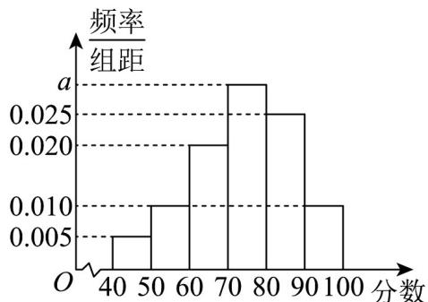

<!-- question-source:start -->
【变式3】文明城市是反映城市整体文明水平的综合性荣誉称号，作为普通市民，既是文明城市的最大受益

者，更是文明城市的主要创造者，某市为提高市民对文明城市创建的认识，举办了“创建文明城市”知识竞赛，

从所有答卷中随机抽取 $100$ 份作为样本，将样本的成绩（满分 $100$ 分，成绩均为不低于 $40$ 分的整数）分成六

段： $[40,50)$ ， $[50,60)$ ，…， $[90,100]$ 得到如图所示的频率分布直方图·

(1)求频率分布直方图中 a 的值；

(2)求样本成绩的第 $^{75}$ 百分位数；

(3)现从该样本成绩中落在 $[60,70)$ 的平均成绩是 $65$ ，方差是 $5$ ，落在 $[70,80)$ 的平均成绩是 $75$ ，方差是 $7$ ，求

两组成绩的总平均数与方差·
<!-- question-source:end -->

![[高中/课堂同步/题库/人教A版高中数学同步讲义(2026)/02_必修第二册/第九章 统计/讲义/专题9_2_用样本估计总体_高效培优讲义_数学人教A版高一必修第二册/_compact/answers/Q00064881A1.md]]
