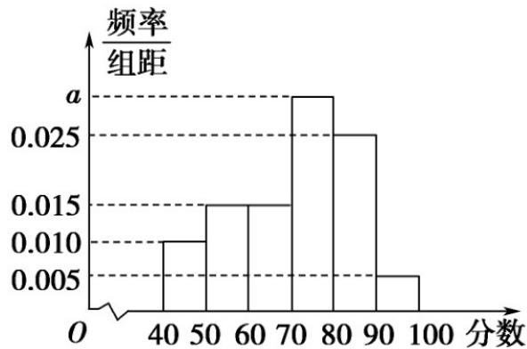

<!-- question-source:start -->
【变式3】2025年4月24日神舟二十号载人飞船发射升空，航天员乘组已开展多次出舱活动·某学校高一年

级利用高考放假期间组织 $^{1200}$ 名学生参加线上航天知识竞赛活动，现从中抽取 $^{200}$ 名学生，记录他们的首轮

竞赛成绩并作出如图所示的频率直方图，根据图形，请回答下列问题：

(1)若从成绩不高于 $60$ 分的同学中按分层抽样方法抽取 $^5$ 人成绩，求 $^5$ 人中成绩不高于 $^{50}$ 分的人数；

(2)以样本估计总体，利用组中值估计该校学生首轮竞赛成绩的平均数以及中位数·
<!-- question-source:end -->

![[高中/课堂同步/题库/人教A版高中数学同步讲义(2026)/02_必修第二册/第九章 统计/讲义/专题9_2_用样本估计总体_高效培优讲义_数学人教A版高一必修第二册/_compact/answers/Q00064884A1.md]]
