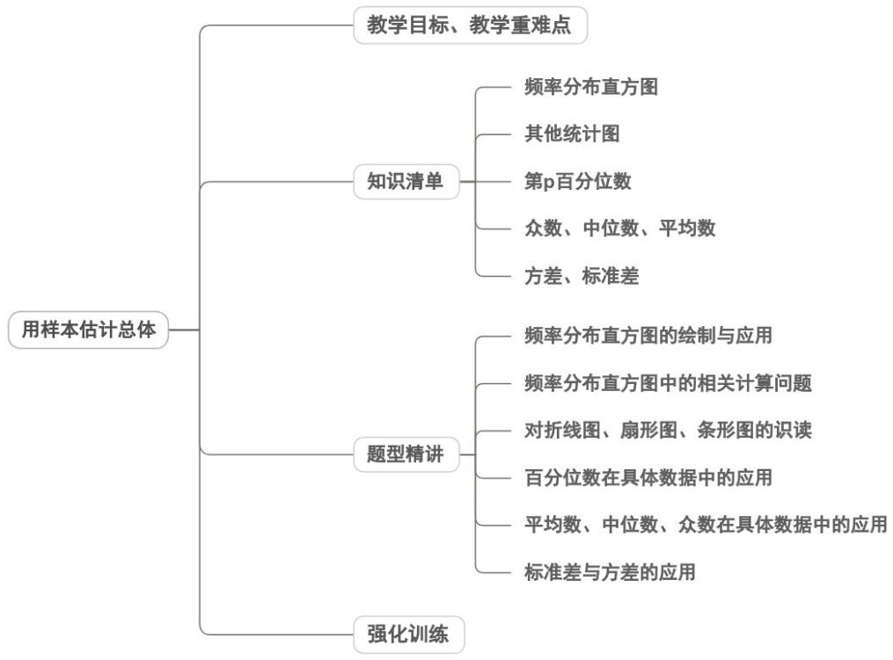

<!-- source-part:1 pages:1-50 -->

专题9.2 用样本估计总体

教学目标、教学重难点

<table><tr><td>教学目标</td><td>1.掌握样本频率分布表、频率分布直方图的制作步骤,能从图表中提取众数、中位数、平均数等关键信息2.理解样本数字特征(众数、中位数、平均数、方差、标准差)的定义,会精准计算,明确各特征的统计意义3.掌握用样本数字特征估计总体数字特征的核心方法,知晓样本代表性对估计准确性的影响4.能结合频率分布直方图估算中位数、平均数,区分图表估算与直接计算的差异,会用方差、标准差分析数据离散程度</td></tr><tr><td>教学重难点</td><td>1.重点样本众数、中位数、平均数、方差、标准差的定义+精准计算,明确各特征的核心作用(集中趋势/离散程度)2.难点方差、标准差的计算逻辑与意义理解(公式记忆难、易算错,难区分“数据波动大”与“估计误差大”)</td></tr></table>

![[高中/课堂同步/题库/人教A版高中数学同步讲义(2026)/02_必修第二册/第九章 统计/讲义/专题9_2_用样本估计总体_高效培优讲义_数学人教A版高一必修第二册/知识清单_sec_01/知识清单_sec_01.md]]
![[高中/课堂同步/题库/人教A版高中数学同步讲义(2026)/02_必修第二册/第九章 统计/讲义/专题9_2_用样本估计总体_高效培优讲义_数学人教A版高一必修第二册/知识点_01_频率分布直方图_sec_02/知识点_01_频率分布直方图_sec_02.md]]
![[高中/课堂同步/题库/人教A版高中数学同步讲义(2026)/02_必修第二册/第九章 统计/讲义/专题9_2_用样本估计总体_高效培优讲义_数学人教A版高一必修第二册/即学即练_sec_03/即学即练_sec_03.md]]
![[高中/课堂同步/题库/人教A版高中数学同步讲义(2026)/02_必修第二册/第九章 统计/讲义/专题9_2_用样本估计总体_高效培优讲义_数学人教A版高一必修第二册/知识点_02_其他统计图_sec_04/知识点_02_其他统计图_sec_04.md]]
![[高中/课堂同步/题库/人教A版高中数学同步讲义(2026)/02_必修第二册/第九章 统计/讲义/专题9_2_用样本估计总体_高效培优讲义_数学人教A版高一必修第二册/即学即练_sec_05/即学即练_sec_05.md]]
![[高中/课堂同步/题库/人教A版高中数学同步讲义(2026)/02_必修第二册/第九章 统计/讲义/专题9_2_用样本估计总体_高效培优讲义_数学人教A版高一必修第二册/知识点_03_第_p_百分位数_sec_06/知识点_03_第_p_百分位数_sec_06.md]]
![[高中/课堂同步/题库/人教A版高中数学同步讲义(2026)/02_必修第二册/第九章 统计/讲义/专题9_2_用样本估计总体_高效培优讲义_数学人教A版高一必修第二册/知识点_04_众数_中位数_平均数_sec_07/知识点_04_众数_中位数_平均数_sec_07.md]]
![[高中/课堂同步/题库/人教A版高中数学同步讲义(2026)/02_必修第二册/第九章 统计/讲义/专题9_2_用样本估计总体_高效培优讲义_数学人教A版高一必修第二册/知识点_05_方差_标准差_sec_08/知识点_05_方差_标准差_sec_08.md]]
![[高中/课堂同步/题库/人教A版高中数学同步讲义(2026)/02_必修第二册/第九章 统计/讲义/专题9_2_用样本估计总体_高效培优讲义_数学人教A版高一必修第二册/即学即练_sec_09/即学即练_sec_09.md]]
![[高中/课堂同步/题库/人教A版高中数学同步讲义(2026)/02_必修第二册/第九章 统计/讲义/专题9_2_用样本估计总体_高效培优讲义_数学人教A版高一必修第二册/题型精讲_sec_10/题型精讲_sec_10.md]]
![[高中/课堂同步/题库/人教A版高中数学同步讲义(2026)/02_必修第二册/第九章 统计/讲义/专题9_2_用样本估计总体_高效培优讲义_数学人教A版高一必修第二册/题型01_频率分布直方图的绘制与应用_sec_11/题型01_频率分布直方图的绘制与应用_sec_11.md]]
![[高中/课堂同步/题库/人教A版高中数学同步讲义(2026)/02_必修第二册/第九章 统计/讲义/专题9_2_用样本估计总体_高效培优讲义_数学人教A版高一必修第二册/题型02_频率分布直方图中的相关计算问题_sec_12/题型02_频率分布直方图中的相关计算问题_sec_12.md]]
![[高中/课堂同步/题库/人教A版高中数学同步讲义(2026)/02_必修第二册/第九章 统计/讲义/专题9_2_用样本估计总体_高效培优讲义_数学人教A版高一必修第二册/题型03_对折线图_扇形图_条形图的识读_sec_13/题型03_对折线图_扇形图_条形图的识读_sec_13.md]]
![[高中/课堂同步/题库/人教A版高中数学同步讲义(2026)/02_必修第二册/第九章 统计/讲义/专题9_2_用样本估计总体_高效培优讲义_数学人教A版高一必修第二册/题型05_平均数_中位数_众数在具体数据中的应用_sec_14/题型05_平均数_中位数_众数在具体数据中的应用_sec_14.md]]
![[高中/课堂同步/题库/人教A版高中数学同步讲义(2026)/02_必修第二册/第九章 统计/讲义/专题9_2_用样本估计总体_高效培优讲义_数学人教A版高一必修第二册/题型06_标准差与方差的应用_sec_15/题型06_标准差与方差的应用_sec_15.md]]
![[高中/课堂同步/题库/人教A版高中数学同步讲义(2026)/02_必修第二册/第九章 统计/讲义/专题9_2_用样本估计总体_高效培优讲义_数学人教A版高一必修第二册/强化训练_sec_16/强化训练_sec_16.md]]
