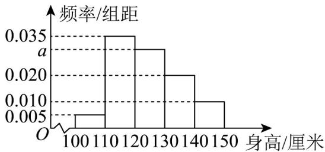

<!-- question-source:start -->
2. 从某小学随机抽取 $100$ 名同学，将他们的身高（单位：厘米）数据绘制成频率分布直方图（如图）。由图

中数据可知 $a =$ （结果保留3位小数）．若要从身高在 $[120,130)$ ， $[130,140)$ ， $[140,150]$ 三组的学生中，

用分层随机抽样的方法选取 $^{18}$ 人参加一项活动，则从身高在 $^{[140,150]}$ 的学生中选取的人数应为\_\_\_\_。

<!-- question-source:end -->

![[高中/课堂同步/题库/人教A版高中数学同步讲义(2026)/02_必修第二册/第九章 统计/讲义/专题9_2_用样本估计总体_高效培优讲义_数学人教A版高一必修第二册/即学即练_sec_03/questions/answers/Q00064867A1.md]]
