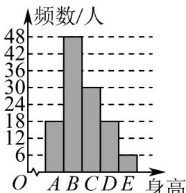
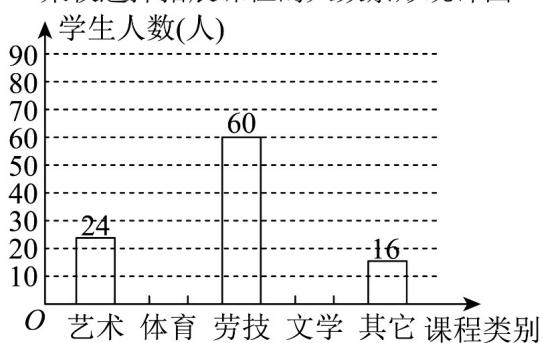
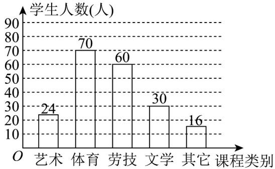

> [!faq]- 《专题9_2_用样本估计总体_高效培优讲义_数学人教A版高一必修第二册》官方解析
>
> > [!success]- **【答案】** 女生身高情况直方图 男生身高情况扇形图   A. 女生人数多于男生人数（） B. D层次男生人数多于女生人数 C. B层次男生人数为 $^{24}$ 人 D. A层次人数最少
>
> > [!note]- **【分析】**
> > 根据表中数据依次讨论各选项即可求解·
>
> > [!note]- **【解析】**
> > 对于 $^{A}$ 选项，由题可知，女生A层次的有 $^{18}$ 人，B层次的有 $^{48}$ 人，C层次的有 $^{30}$ 人，D层次的有
> >
> > 18 人，E 层次的有 6 人，故女生共有 $18 + 48 + 30 + 18 + 6 = 120$ 人，
> >
> > 男生有 200 - 120 = 80 人，所以女生人数多于男生人数，故 A 选项正确；
> >
> > 对于 $^{B}$ 选项，由扇形图知，男生D层次的有 $80\times20\%=16$ 人，而女生有 $^{18}$ 人，故女生多于男生，错误；
> >
> > 对于 C 选项，B 层次的有 $80 \times (1 - 20\% - 25\% - 15\% - 10\%) = 80 \times 30\% = 24$ 人，故正确；
> >
> > 对于 D 选项，A 层次的有 $18 + 80 \times 10\% = 26$ 人，E 层次的有 $6 + 80 \times 15\% = 18$ 人，故 A 层次的人数不是最少的。
> >
> > 故选：AC
> >
> > 2. 为深化义务教育课程改革，某校积极开展拓展性课程建设，计划开设艺术、体育、劳技、文学等多个类别
> >
> > 的拓展性课程，要求每一位学生都自主选择一个类别的拓展性课程．为了了解学生选择拓展性课程的情况，
> >
> > 随机抽取了部分学生进行调查，并将调查结果绘制成如下统计图（部分信息未给出）：
> >
> > 某校选择拓展课程的人数条形统计图 某校选择拓展课程的人数扇形统计图
> >
> > 
> >
> > 根据统计图中的信息，解答下列问题：
> >
> > 
> >
> > (1)求本次被调查的学生人数.
> >
> > (2)将条形统计图补充完整.
> >
> > (3)若该校共有 1600 名学生，请估计全校选择体育类的学生人数。
> >
> > 【答案】(1)200
> >
> > (2)答案见解析
> >
> > (3)560
> >
> > 【分析】（1）结合题中给出的条形图和扇形图，选择劳技的人数和百分率都知道，即可求出被调查的学生人
> >
> > 数；
> >
> > (2) 有了总体，由扇形图可知选择文学的百分率是 $15\%$ ，即可求出选择文学的人数，再用学生总人数减去
> >
> > 艺术、劳技、文学、其他的人数，得到选择体育的人数，并据此画完该条形图；
> >
> > (3) 根据用样本估计总体的方法，先计算选择体育类的百分率，再乘以全校总人数即可·
> >
> > 【详解】（1）由条形图和扇形图，选择劳技的人数为 $60$ 人，百分率是 $30\%$ ，
> >
> > 则被调查学生的总人数为： $60 \div 30\% = 200$ （人）；
> >
> > (2) 选择文学的百分率是 $15\%$ ，由 (1) 知被调查学生的总人数为 200 人；
> >
> > 则选择文学的学生人数为： $200 \times 15\% = 30$ （人），
> >
> > 选择体育的学生人数：200-24-60-30-16=70（人），
> >
> > 完成的条形图如下：
> >
> > 某校选择拓展课程的人数条形统计图
> >
> > 
> >
> > (3) 选择体育类的百分比为 200，
> >
> > 所以估计全校选择体育类的学生有 $1600 \times \frac{70}{200} = 560$ （人）.
