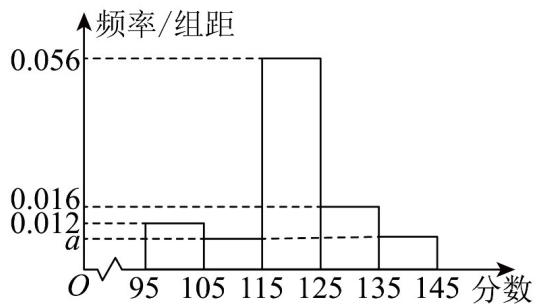

<!-- question-source:start -->
1. 某学校高一年级某班男同学与女同学的人数之比为 $5:4$ ，在学校的一次月考中，某数学教师为分析本班的

成绩，作了如下统计：

女同学成绩频数分布表

<table><tr><td>成绩值区间</td><td>[95,105)</td><td>[105,115)</td><td>[115,125)</td><td>[125,135)</td><td>[135,145]</td><td>合计</td></tr><tr><td>频数</td><td>3</td><td>4</td><td>10</td><td>2</td><td>1</td><td>20</td></tr></table>

男同学成绩频率分布直方图

(1)估计本班女同学成绩的平均数 $\overline{x}$ （同一组中的数据用该组区间的中点值作代表）；

(2)根据男同学成绩的频率分布直方图，比较男同学成绩的平均数与中位数的大小；

(3)已知女同学成绩的方差为 $169$ ，男同学成绩的方差为 $104$ ，估计该班全体同学成绩的方差（平均用四舍五

入取整数计算，方差结果取整数）·

参考公式：总体划分为女生和男生 $^{2}$ 层，通过分层随机抽样，各层抽取的样本量、样本平均数和样本方差分

别为 $m$ ， $\overline{x}$ ， $s_1^2$ ； $n$ ， $\overline{y}$ ， $s_2^2$ ，记总的样本平均数和样本方差分别为 $\overline{\omega}$ ， $s^2$ ，则

$$
s ^ {2} = \frac {m}{m + n} \left[ s _ {1} ^ {2} + (\bar {x} - \bar {\omega}) ^ {2} \right] + \frac {n}{m + n} \left[ s _ {2} ^ {2} + (\bar {y} - \bar {\omega}) ^ {2} \right].
$$
<!-- question-source:end -->

![[高中/课堂同步/题库/人教A版高中数学同步讲义(2026)/02_必修第二册/第九章 统计/讲义/专题9_2_用样本估计总体_高效培优讲义_数学人教A版高一必修第二册/即学即练_sec_09/questions/answers/Q00064869A1.md]]
