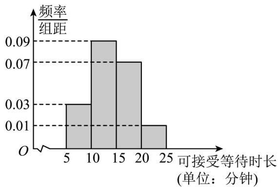

<!-- question-source:start -->
10．某中学新建了学校食堂，每天有近 $^{2000}$ 名学生在学校食堂用午餐，午餐开放时间约 $^{40}$ 分钟，食堂制作

了三类餐食，第一类是选餐，学生凭喜好在做好的大约 $^{6}$ 种菜和主食米饭中任意选购；第二类是套餐，已按

配套好菜色盛装好，可直接取餐；第三类是面食，如煮面、炒粉等，为了更合理地设置窗口布局，增加学生

的用餐满意度，学校学生会在用餐的学生中对就餐选择、各类餐食的平均每份取餐时长以及可接受等待时间

进行问卷调查，并得到以下的统计图表·

<table><tr><td>类别</td><td>选餐</td><td>套餐</td><td>面食</td></tr><tr><td>选择人数</td><td>50</td><td>30</td><td>20</td></tr><tr><td>平均每份取餐时长(单位:分钟)</td><td>2</td><td>0.5</td><td>1</td></tr></table>

已知饭堂的售饭窗口一共有 $^{20}$ 个，就餐高峰期时有 $^{200}$ 名学生在等待就餐·

(1)根据以上的调查统计，如果设置 $^{12}$ 个选餐窗口， $^{4}$ 个套餐窗口， $^{4}$ 个面食窗口，就餐高峰期时，假设大家

在排队时自动选择较短的队伍等待（即各类餐食的窗口前队伍长度各自相同），问：选择选餐的同学最长等

待时间是多少？这能否让 $80 \%$ 的同学感到满意（即在接受等待时长内取到餐）？

(2)根据以上的调查统计，从等待时长和公平的角度上考虑，如何设置各类售饭窗口数更优化，并给出你的求

解过程·
<!-- question-source:end -->

![[高中/课堂同步/题库/人教A版高中数学同步讲义(2026)/02_必修第二册/第九章 统计/讲义/专题9_2_用样本估计总体_高效培优讲义_数学人教A版高一必修第二册/强化训练_sec_16/questions/answers/Q00064894A1.md]]
