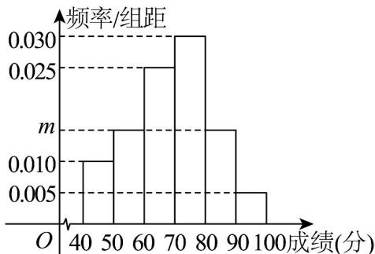

> [!faq]- 《专题9_2_用样本估计总体_高效培优讲义_数学人教A版高一必修第二册》官方解析
>
> > [!success]- **【答案】** C
>
> > [!note]- **【分析】**
> > 根据极差、中位数、方差、百分位数的求法，通过举反例或对计算公式、所得数据的分析判断各项
> >
> > 的正误·
>
> > [!note]- **【解析】**
> > A，若随机删去任一轮的成绩，恰好不是最高成绩和最低成绩，此时新数据的极差等于原数据的极
> >
> > 差，A 错误；
> >
> > B，不妨设 $x_{1} < x_{2} < x_{3} < x_{4} < x_{5}$ ，当 $\frac{1}{2}\left(x_2 + x_4\right) = x_3$ 时，若随机删去的成绩是 $x_{3}$ ，此时新数据的中位数等于原数
> >
> > 据的中位数， $^{B}$ 错误；
> >
> > C，若 $\overline{x} = \overline{y}$ ，即删去的数据恰为平均数，根据方差的计算公式，分子不变，分母变小，此时方差会变大，C
> >
> > 正确；
> >
> > D，在按从小到大的顺序排列的5个数据中 $5 \times 60\% = 3$
> >
> > 此时原数据的 $60\%$ 分位数为第三个数和第四个数的平均数，即 $\frac{x_3 + x_4}{2}$ ，
> >
> > 删去一个数据后的4个数据，按从小到大的顺序排列，可得 $4 \times 60\% = 2.4$ ，
> >
> > 此时新数据的 $60\%$ 分位数为第三个数，即 $x_{3}$ 或 $x_{4}$ ，而 $x_{3} < x_{4}$ ，则 $x_{3} < \frac{x_{3} + x_{4}}{2} < x_{4}$
> >
> > 显然新数据的 60% 分位数不等于原数据的 60% 分位数，D 错误。
> >
> > 故选：C
> >
> > 6. 为了帮助高一学生更好地了解自己适合选报物理还是历史，某校在学生选科之前组织了一场物理考试，并
> >
> > 从中随机抽取了部分学生的成绩（满分为 $100$ 分），将数据整理得到如图所示的频率分布直方图。根据该频
> >
> > 率分布直方图，用样本估计总体，则（ ）.
> >
> > 
> >
> > A. 频率分布直方图中的 $m$ 的值为 0.15
> > B. 该年级物理成绩的众数的估计值为 80 分
> > C. 该年级物理成绩的平均数的估计值为 75 分
> > D. 若物理成绩排名前 70% 的学生适合选报物理，则适合选报物理的学生此次成绩应不低于 62 分
> >
> > 【答案】D
> >
> > 【分析】 $^{A}$ 选项由小长方形的面积之和是1可求出m， $^{B}$ 选项根据最高的长方形中点值判断， $^{C}$ 选项根据平均
> >
> > 数公式求解， $^{D}$ 选项先判断30%分位数所在区间，然后列方程求解·
> >
> > 【详解】A选项，由小长方形的面积之和是1，得到 $10(0.005+0.01+2m+0.025+0.030)=1$ ，解得m=0.015
> >
> > A 选项错误；
> >
> > B 选项，由图可知，众数的估计值是75，B 选项错误；
> >
> > C 选项，由图可知，平均值是 $45 \times 0.1 + 55 \times 0.15 + 65 \times 0.25 + 75 \times 0.3 + 85 \times 0.15 + 95 \times 0.05 = 69$ ，C 选项错误；
> >
> > D 选项，物理成绩排名前 $70\%$ 的学生，等效于求解图中 $30\%$ 分位数，
> >
> > 由图[40,60]的频率是0.25，[40,70]的频率是0.5，故 $30\%$ 分位数出现在[60,70]，
> >
> > 设其为 x ，则 $(x-60)\times0.025+0.25=0.3$ ，解得 x=62 ，D 选项正确·
> >
> > 故选 **D**
