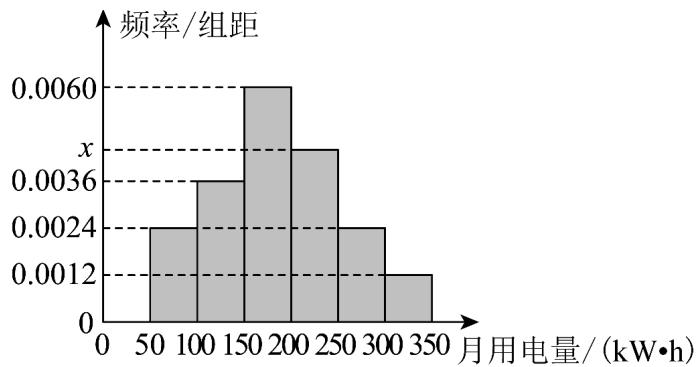

## 知识点 03 第 p 百分位数

1、第 $p$ 百分位数的定义

一般地，一组数据的第 $p$ 百分位数是这样一个值，它使得这组数据中至少有 $p\%$ 的数据小于或等于这个值，

且至少有 $(100 - p)\%$ 的数据大于或等于这个值.

2、计算第 $p$ 百分位数的步骤

第1步：按从小到大排列原始数据.

第2步：计算 $i=n\times p\%$ .

第3步：若 $i$ 不是整数，而大于 $i$ 的比邻整数为 $j$ ，则第 $p$ 百分位数为第 $j$ 项数据；若 $i$ 是整数，则第 $p$ 百分位

数为第 $i$ 项与第 $(i + 1)$ 项数据的平均数.

【即学即练】

1. 为有助于形成节能减排的社会共识，促进资源节约型，环境友好型社会的建设，某市拟建立“多用者多付

费”的阶梯电价机制，要求约 $75\%$ 的居民用电量在第一阶梯内，约 $20\%$ 的居民用电量在第二阶梯内，约 $5\%$ 的

居民用电量在第三阶梯内·假设从该市抽取了 $200$ 户居民的用电量（单位： $\mathrm{kW} \cdot \mathrm{h}$ ）进行整理，并由此作出如

图所示的频率分布直方图·根据用样本估计总体的思想确定阶梯电价的临界点 $a, b$ ，并且每户的用电单价与每

户用电量的关系如下表所示·记户月用电量为 $x\mathrm{kW}\cdot \mathrm{h}$ 时应缴纳的电费为 $f(x)$ 元

<table><tr><td rowspan="4"></td><td>分档</td><td>户用电量(单位:kW·h)</td><td>用电单价(单位:元/kW·h)</td></tr><tr><td>第一阶梯</td><td>0~a(含a)</td><td>0.5</td></tr><tr><td>第二阶梯</td><td>a~b(含b)</td><td>0.55</td></tr><tr><td>第三阶梯</td><td>b~+∞</td><td>0.8</td></tr></table>

(1)求 $a$ ， $b$ 的值；

(2)写出 $f(x)$ 的解析式；

(3)小明家本月缴纳电费 $195$ 元，他家本月用电量是多少？

【答案】(1) $a = 200$ ， $b = 300$

$$
f (x) = \left\{ \begin{array}{l} 0. 5 x, 0 <   x \leq 2 0 0 \\ 0. 5 5 x - 1 0, 2 0 0 <   x \leq 3 0 0 \\ 0. 8 x - 8 5, x > 3 0 0 \end{array} \right. \tag {2}
$$

(3) $350 \, kW \cdot h$

【分析】（ $^{1}$ ）根据频率分布直方图求解百分位数即可得解，

(2) (3) 根据阶梯电费，即可根据分段函数的性质求解.

【详解】（1）由题 $a, b$ 分别为这组数据的 $75\%$ 分位数、 $95\%$ 分位数·

$0.75 = 0.0025 \times 100 + (a - 100) \times 0.005$ ，解得 $a = 200$ ，

$$
0. 9 5 = 0. 0 0 2 5 \times 1 0 0 + 0. 0 0 5 \times 1 0 0 + (b - 2 0 0) \times 0. 0 0 2 \text {, 解 得} b = 3 0 0
$$

(2) $f(x)$ 是一个分段函数，而且：当 $0 < x \leq 200$ 时，有 $f(x) = 0.5x$ ；

当 $200 < x \leq 300$ 时，有 $f(x) = 0.5 \times 200 + (x - 200) \times 0.55 = 0.55x - 10$ ；

当 $x > 300$ 时，有 $f(x) = 0.5 \times 200 + (300 - 200) \times 0.55 + (x - 300) \times 0.8 = 0.8x - 85$

$$
f (x) = \left\{ \begin{array}{l} 0. 5 x, 0 <   x \leq 2 0 0 \\ 0. 5 5 x - 1 0, 2 0 0 <   x \leq 3 0 0 \\ 0. 8 x - 8 5, x > 3 0 0 \end{array} . \right.
$$

(3) 若 $0 < x \leq 200$ ， $f(x) \leq 0.5 \times 200 = 100$ ；

若 $200 < x \leq 300$ ， $f(x) \leq 0.55 \times 300 - 10 = 155$

因为 $f(x)=195$ ，所以 x>300，0.8x-85=195 解得 x=350。

答：小明家本月用电量是 $350\mathrm{kW}\cdot \mathrm{h}$

2. 某市通过简单随机抽样，获得了 $1000$ 户居民用户的月均用电量数据，发现他们的用电量都在

$50\sim 350\mathrm{kW}\cdot \mathrm{h}$ 之间，进行适当分组后（每组为左闭右开的区间），画出频率分布直方图如图所示

(1)求直方图中 $x$ 的值；

(2)求在被调查的用户中，用电量落在区间 $\left[50,200\right)$ 内的用户数；

(3)该市政府计划对居民生活用电费用实施阶梯式电价制度，即确定一个居民月均用电量标准 $a$ ，用电量不超

过 $a$ 的部分按平价收费，超出 $a$ 的部分按议价收费·如果希望 $80\%$ 的居民生活用电费用支出不受影响，将 $a$ 定

为 $250kW \cdot h$ 是否合理？请说明理由·

【答案】(1) $x = 0.0044$

(2)600

(3)合理，理由见解析

【分析】（1）根据频率和为 $^{1}$ ，列式计算求出参数；

(2) 先计算频率再计算用户数；

(3) 应用频率分布直方图列式计算频率结合已知说明理由·

【详解】（1）根据频率和为 $^{1}$ ，可知

$\left(0.0024 + 0.0036 + 0.0060 + x + 0.0024 + 0.0012\right) \times 50 = 1$ ，计算得： $x = 0.0044$ ；

$$
(2) (0. 0 0 2 4 + 0. 0 0 3 6 + 0. 0 0 6 0) \times 5 0 \times 1 0 0 0 = 6 0 0;
$$

$$
(3) (0. 0 0 2 4 + 0. 0 0 3 6 + 0. 0 0 6 0 + 0. 0 0 4 4) \times 5 0 = 0. 8 2
$$

合理，样本的第 $^{80}$ 百分位数接近于 $^{250}$ ，由于样本的取值规律与总体的取值规律之间会存在偏差，

在实际决策中，只要临界值近似为第 $^{80}$ 百分位数即可，为了实际中操作方便，

可以建议市政府把月均用电量标准定为 $250 \, kW \cdot h$ .
